# Smart Retail AI Ecosystem, created by NextGenOS

**Smart Retail POS** by **NextGenOS**: proprietary software for any kind of business, in any country, with the customer's own name on it. (A customer's name and look live only in that customer's brand kit and licence, never in the product.)

## Start here

| I want to ... | Read |
|---|---|
| sell it | `docs/SALES-PLAYBOOK.md` |
| install it and use it | `docs/CUSTOMER-GUIDE.md` |
| make and test a release | `docs/RELEASE-GUIDE.md` |
| set up the Licence Studio and hand out licences | `licensing/README.md` |
| give a customer their own look | `docs/BRAND-STUDIO.md` |
| know what is protected, and what is not | `docs/SECURITY-MODEL.md` |
| see what must still be done before selling | `docs/COMMERCIALIZATION_READINESS.md` |
| work on the code | `CLAUDE.md` (rules for everyone, human or AI), then the folder's README |
| check that everything works | `node scripts/verify-all.mjs --full` |

The **Business Hub** (`apps/business-hub`) is the program for every kind of business; the older Windows POS, AI add-on and dashboard (`apps/pos-*`) are India-GST editions; the website and Android app are in `apps/storefront-web-mobile`.

---

# Smart Retail Suite - Unified Enterprise Platform

Welcome to the **Smart Retail Suite**, a complete, unified omnichannel retail platform created by combining the three core codebases of the **NextGenOS & Demo Mart** ecosystem into a single unified monorepo.

---

## 1. Unified Architecture Overview

The suite bridges physical in-store checkout counters with AI-powered till assistance, modern cloud dashboards, and multi-platform digital storefronts.

```mermaid
flowchart TD
    subgraph ClientLayer["Frontend & Client Workstations"]
        DesktopPOS["Core WinForms POS Station\n(.NET 4.8 / VB.NET)\n[apps/pos-desktop]"]
        AIAssistant["Smart Retail AI Companion\n(WPF / WebView2)\n[apps/pos-ai-companion]"]
        DashboardUI["Web Dashboard & Photo Studio\n(ASP.NET Core .NET 8)\n[apps/pos-dashboard-service]"]
        WebStorefront["Demo Mart Storefront\n(Next.js 15 / React 19)\n[apps/storefront-web-mobile]"]
        MobileClient["Mobile Apps (Android & iOS)\n(Capacitor)"]
        ElectronClient["Desktop Shopping App\n(Electron 42)"]
    end

    subgraph ServiceLayer["Local & Cloud Services"]
        LocalSQL[(Local SQL Server\nPOS Database)]
        SupabaseCloud[(Supabase Remote\nOwner Telemetry)]
        PrismaPostgres[(Prisma PostgreSQL\nStorefront Database)]
        FirebaseSync[(Firebase Realtime\nCatalog Sync)]
    end

    subgraph AIEngine["Omnichannel AI Intelligence"]
        GroqRouter["Groq API\n(Instant Chat & Deals)"]
        LightningRouter["Lightning AI DeepSeek-V4\n(Styling & Semantic Search)"]
        VisionModels["Gemma 4 31B & Nemotron 30B\n(Visual Product Search)"]
        LocalCLI["Codex / Claude / Antigravity CLI\n(In-Store POS Answering)"]
    end

    DesktopPOS <--> LocalSQL
    DesktopPOS <--> FirebaseSync
    AIAssistant -. Reads .-> LocalSQL
    AIAssistant <--> LocalCLI
    DashboardUI -. Reads .-> LocalSQL
    DashboardUI --> SupabaseCloud
    WebStorefront <--> PrismaPostgres
    WebStorefront --> MobileClient
    WebStorefront --> ElectronClient
    WebStorefront <--> GroqRouter
    WebStorefront <--> LightningRouter
    WebStorefront <--> VisionModels
```



---

## 2. Directory Layout & Subsystem Roles

```
smart-retail-suite/
│
├── apps/
│   ├── pos-desktop/             # [From Smart-Retail-POS-by-NextGen-OS-main.zip]
│   │   ├── Source/              # DemoMart99 Master Solution (13 WinForms & Library projects)
│   │   ├── Drivers/             # Receipt printers, barcode scanners, and peripheral drivers
│   │   ├── Fonts/               # Barcode (Code128/39) and receipt fonts
│   │   ├── Setup/               # SQL Server database restore files and deployment scripts
│   │   ├── Documentation/       # Comprehensive POS architecture and screen inventories
│   │   └── installer/           # Deployment packaging files
│   │
│   ├── pos-ai-companion/        # [From Test-main.zip -> SmartRetailAI]
│   │   ├── src/                 # SmartRetail.AI.Core and SmartRetail.AI.Desktop (WPF .NET 8)
│   │   ├── tests/               # Unit and integration test suites
│   │   ├── installer/           # InnoSetup and NSIS installer scripts
│   │   └── SmartRetailAI.sln    # Dedicated Visual Studio solution for the AI overlay
│   │
│   ├── pos-dashboard-service/   # [From Test-main.zip -> SmartRetailPOS]
│   │   ├── src/                 # SmartRetail.Pos (Core, Data, Vision, Web) in .NET 8
│   │   ├── owner-app/           # Supabase-backed owner remote dashboard web application
│   │   ├── tests/               # Dashboard and Vision test suites
│   │   └── SmartRetailPOS.sln   # Dedicated Visual Studio solution for web services
│   │
│   └── storefront-web-mobile/   # [From demo_shop-master.zip]
│       ├── src/                 # Next.js 15, React 19, and Tailwind CSS app components
│       ├── android/             # Native Android project configuration for Capacitor
│       ├── prisma/              # Database schema (PostgreSQL) and Prisma client migrations
│       ├── main.js              # Electron 42 desktop application entry point
│       └── package.json         # Storefront dependencies, build configs, and scripts
│
├── docs/                        # Consolidated architecture, database, and AI documentation
│   ├── SYSTEM_ARCHITECTURE.md   # System component interaction and data flow
│   ├── DATABASE_GUIDE.md        # SQL Server, SQLite, Supabase, and Prisma guide
│   └── AI_INTEGRATION_GUIDE.md  # Multi-model routing (Groq, Lightning AI, Gemma, Codex)
│
├── scripts/                     # Release gate, package builders and the launcher maker
│   ├── build-all.ps1            # Multi-target build script for .NET and Node.js (for developers)
│   ├── launcher/, lib/build-launcher.mjs  # The small Windows programs that open our programs with no black window
│   └── dev/                     # Helpers for developers that show a window on purpose: "(with a window, for developers)"
│
├── SmartRetailSuite.sln         # Master Visual Studio 2022 Solution uniting all 21 .NET projects
├── package.json                 # Monorepo root npm orchestration configuration
├── .gitignore                   # Unified .gitignore covering .NET, Node, Next.js, and Capacitor
└── README.md                    # This document
```

---

## 3. Subsystem Breakdown

### 3.1. `apps/pos-desktop` - Core In-Store Billing & ERP Workstation
- **Purpose**: The primary workstation running at the retail counter.
- **Tech Stack**: Visual Basic .NET, C#, .NET Framework 4.8 x86, Windows Forms, Crystal Reports, ADO.NET SQL Server.
- **Components**:
  - `DemoMart99 POS`: Billing, batch tracking, inventory audits, cash drawer, and thermal printing.
  - 12 Companion Libraries:
    - `MyDBLibrary`: ADO.NET SQL Server connection and query optimization layer.
    - `DevNet.PhonePe`: UPI dynamic QR generation with webhook confirmation.
    - `DevNet.WhatsApp.V2` & `DevNetWP`: Direct WhatsApp invoice delivery.
    - `DevNetFB`: Firebase Realtime Database catalog sync.
    - `DevNetSR`: Google Cloud Speech-to-Text for cashier voice commands.
    - `DevNet.GS`: Real-time GSTIN validation and address verification.
    - `DevNet.Translitration`: Bilingual English and Hindi bill printing.
    - `DevNet.QImage`: Automatic web product photo enrichment.

### 3.2. `apps/pos-ai-companion` - Till AI Side-Panel
- **Purpose**: A floating desktop overlay docking beside the till screen to assist the cashier or store owner.
- **Tech Stack**: .NET 8.0, C#, WPF, Microsoft Edge WebView2.
- **Features**:
  - Answers stock, pricing, and sales questions in English or Hindi.
  - Interfaces with local AI engines (`codex`, `claude`, `antigravity`) or REST APIs.
  - Strict read-only database access to guarantee transactional safety.

### 3.3. `apps/pos-dashboard-service` - Modern POS Dashboard & Vision
- **Purpose**: Modern web interface for store analytics, product photography enhancement, and remote owner monitoring.
- **Tech Stack**: ASP.NET Core (.NET 8.0), C#, SQLite, Supabase.
- **Features**:
  - Sales forecasting, slow/fast-moving stock analysis, reorder alerts.
  - **AI Photo Studio**: Transforms standard smartphone photos into 5 studio-quality product photos for Amazon and web.
  - **A4 Poster Studio**: Creates promotional sale posters with strict pricing guardrails (offers never dip below cost).
  - **Owner Remote App (`owner-app/`)**: Pushes sanitized high-level turnover metrics to Supabase for mobile viewing from anywhere.

### 3.4. `apps/storefront-web-mobile` - Omnichannel Digital Storefront
- **Purpose**: Customer-facing web app, native mobile apps, and cross-platform desktop application.
- **Tech Stack**: Next.js 15, React 19, TypeScript, Tailwind CSS, Prisma ORM, Capacitor 8, Electron 42.
- **Features**:
  - **Multi-Provider AI Routing**:
    - **Groq**: High-speed customer chat, deals, and quick summaries.
    - **Lightning AI (DeepSeek-V4 Pro)**: Deep reasoning, styling advice, gift recommendations, and semantic filters.
    - **Vision (Gemma 4 31B & Nemotron 30B)**: Multi-modal camera search.
  - Multi-platform: Web (PWA), Android (Capacitor), iOS, and Windows/Mac Desktop (Electron).

---

## 4. Opening the programs

### For the people who use them: every program opens like a program

One icon or Start menu entry opens each program. A window with no address bar appears, and **no black terminal window appears at any time** (`CLAUDE.md`, section 10). Nobody is told to open a terminal or type a command. If something goes wrong, a plain note opens by itself.

| Program | How it is opened | When its window is closed |
|---|---|---|
| Business Hub (the shop program) | The setup puts **Smart Retail POS** on the desktop and in the Start menu. The plain zip has **Start Business Hub** (setup is the normal way) | Keeps running in the background, on purpose: it is the shop's service. Opening it again shows the Hub in a window; there is never a second copy of the Hub |
| Windows POS, AI add-on | The setup's Start menu entry (and its desktop icon, where the setup offers one) opens the program itself: a Windows program, no terminal | As for any Windows program. The AI add-on also has an icon near the clock: right-click it and choose Exit |
| Dashboard on its own | **Start Smart Retail POS** (the icon in its package) | Keeps running in the background, like the Hub. Opening it again shows a window and does not start a second copy |
| Website (one customer's online shop) | **Start Website** (Windows) | Stops the website |
| Setup Studio (for NextGenOS staff) | **Setup Studio** | Stops the Studio |

Each of these also has a file named `... (with a window, for problems)` that shows a window with what the program says, for finding a problem. `docs/CUSTOMER-GUIDE.md` says it again in plain words for the shop owner.

### For developers

The helpers in `scripts/dev` (and `Brand Studio (with a window, for developers).bat`, and the two in `apps/pos-desktop`) start a program from its source and **show a window on purpose**; the words "with a window, for developers" are in their names. They need the .NET SDK or Node.js. A shop or a customer never uses them.

```cmd
npm run dev:storefront        # the online shop's development server, http://localhost:3000
npm run desktop:storefront    # the desktop shopping app (Electron)
scripts\dev\Menu of all programs (with a window, for developers).bat
```

---

## 5. Building the Suite

### Master Build Script (for developers)
Run the automated PowerShell build script:
```powershell
powershell -ExecutionPolicy Bypass -File scripts\build-all.ps1
```
You can also target specific subsystems:
```powershell
# Build only the storefront
powershell -ExecutionPolicy Bypass -File scripts\build-all.ps1 -Storefront

# Build only the .NET 8 services
powershell -ExecutionPolicy Bypass -File scripts\build-all.ps1 -DashboardService -AiCompanion
```

### Visual Studio 2022
Open `SmartRetailSuite.sln` directly in Visual Studio 2022. All 21 projects across Desktop POS, AI Companion, and POS Dashboard Services are organized into distinct Solution Folders.

---

## 6. Environment & AI Key Configuration

Copy the example environment files where applicable:
```bash
# In apps/storefront-web-mobile
cd apps/storefront-web-mobile
cp .env.example .env.local
```
Add your `GROQ_API_KEY` and `LIGHTNING_API_KEY` values, then verify your keys:
```bash
npm run verify:ai
```

---

## 7. Licence

Smart Retail POS is **proprietary software** of NextGenOS. All rights reserved. It is not open source.

- [`LICENSE`](LICENSE): the terms that apply to this source code. Access to it grants no right to use, copy, share, sell, host or rebrand it.
- [`EULA.txt`](EULA.txt): the agreement under which a customer uses the program. It forbids resale, sublicensing, rebranding, reverse engineering and tampering with licence checks. Selling or white-labelling the software needs a separate written reseller agreement with NextGenOS.
- [`THIRD-PARTY-NOTICES.md`](THIRD-PARTY-NOTICES.md) and [`licenses/`](licenses): third-party components keep their own licences.
- [`docs/COMMERCIALIZATION_READINESS.md`](docs/COMMERCIALIZATION_READINESS.md): what has to be done before the suite is sold as a white-label platform in other countries.

Keep this repository private.
