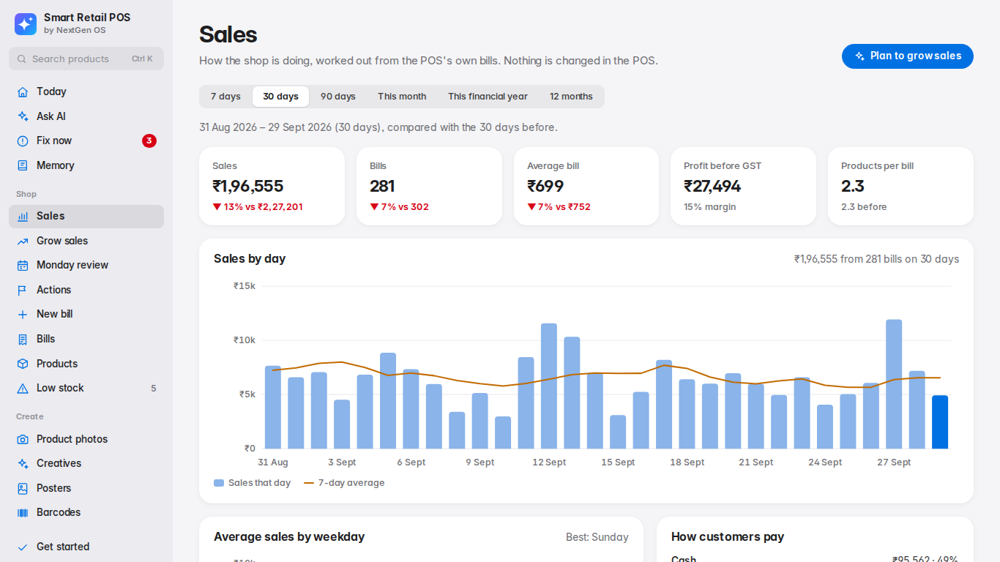
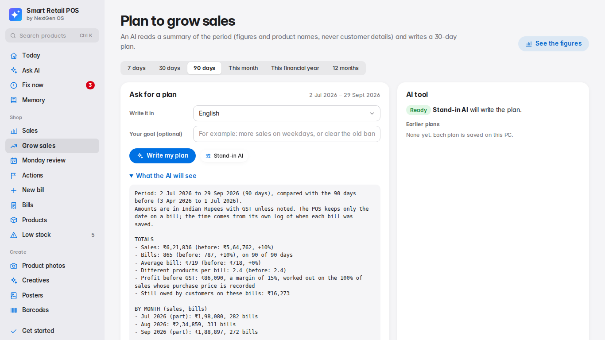
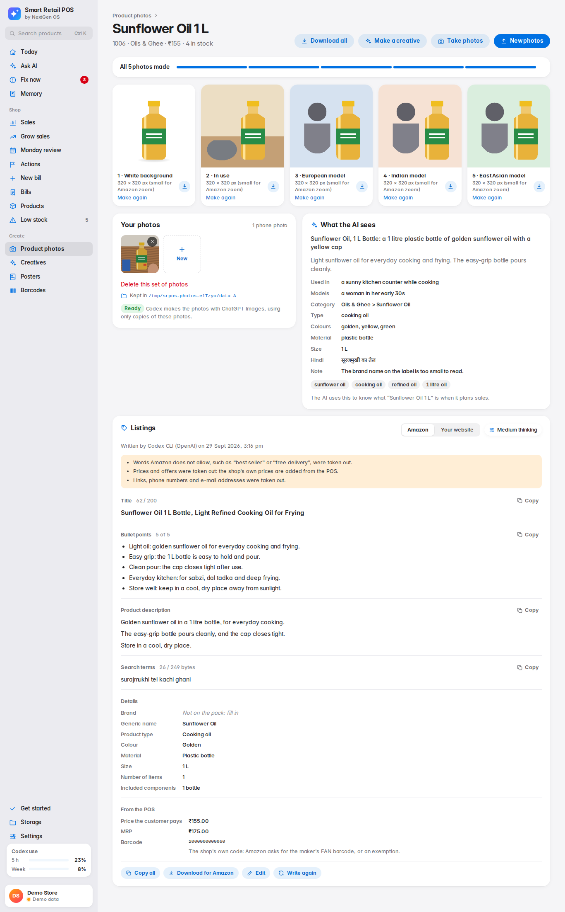
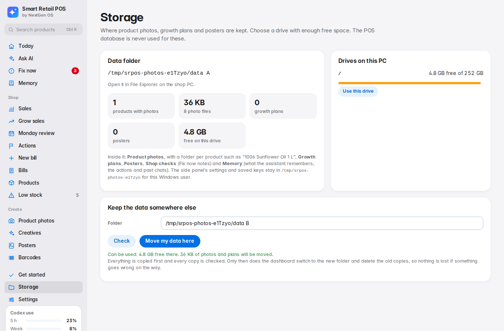
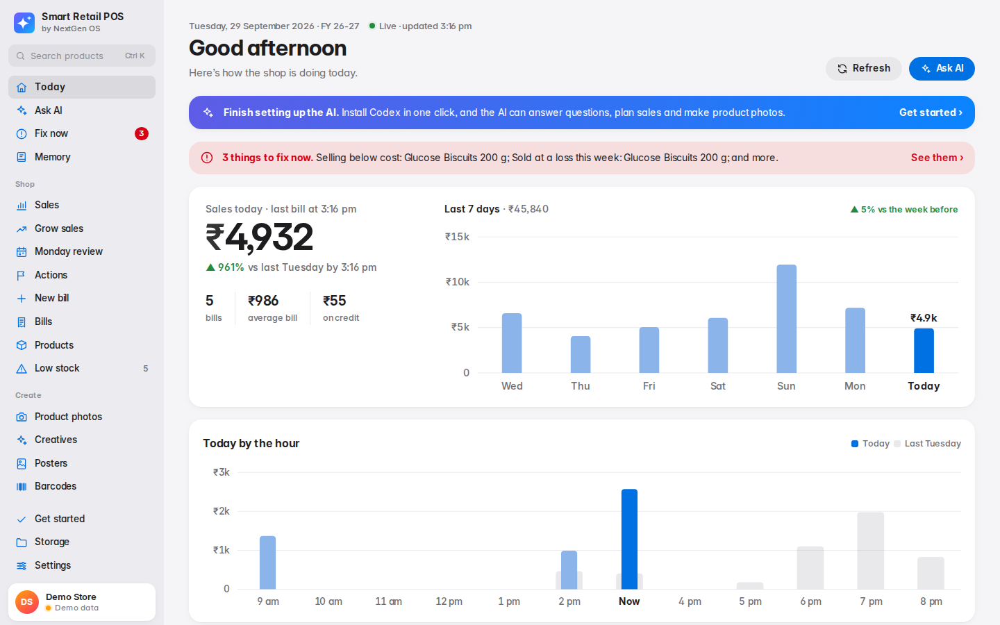
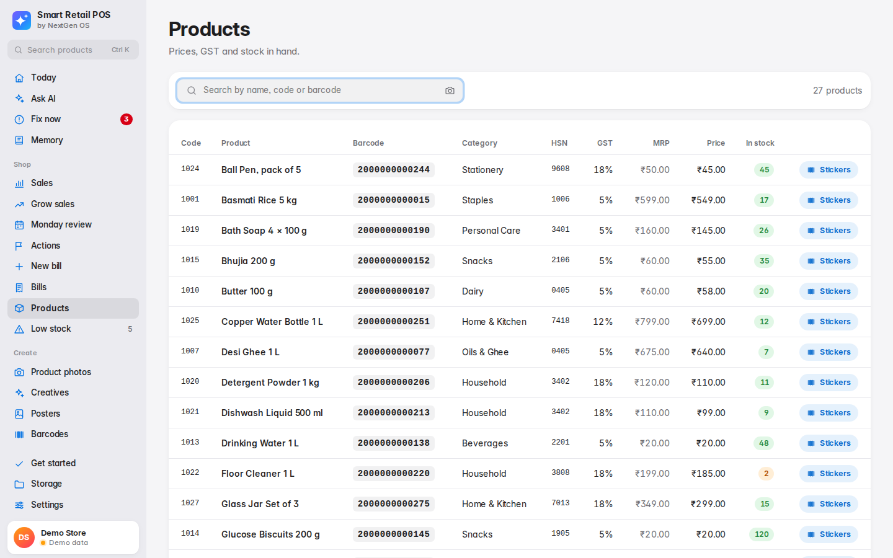
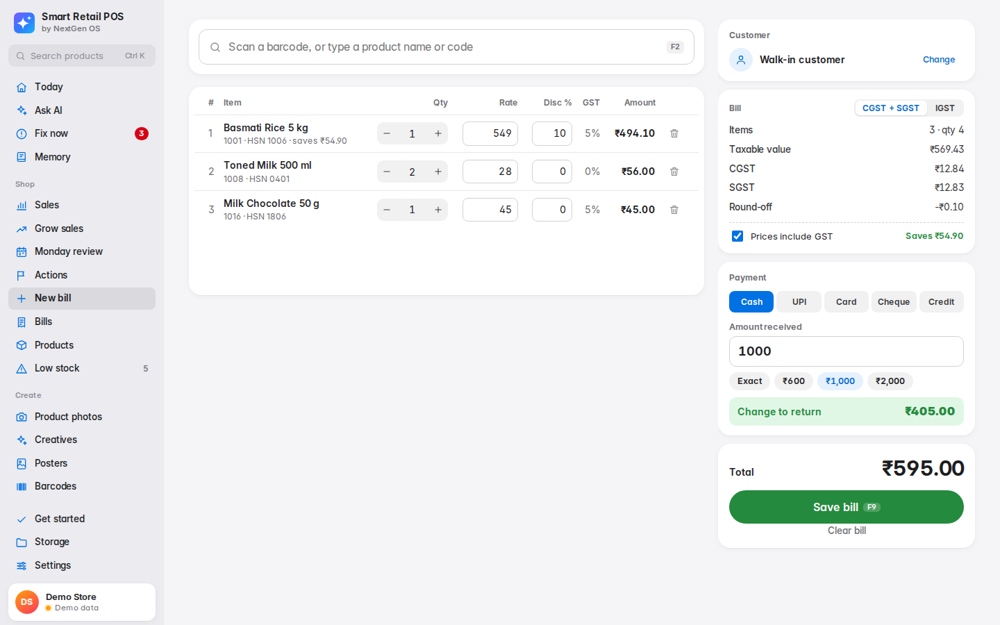
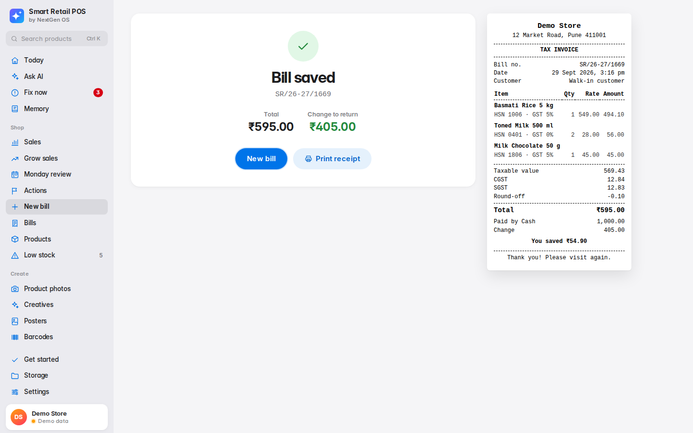

# Smart Retail POS: the app's screens

*by NextGen OS*

Every screen of the Smart Retail POS AI add-on: Today, Ask AI, sales, the growth plan, product photos, storage and settings, in light and dark. It reads the shop's existing POS database and never writes to it. It shows:

- today's sales, and what needs a look today;
- answers to questions about the shop (Ask AI);
- how sales are going;
- which products sell and which do not;
- what to reorder, and what stock to clear or correct;
- how customers pay and whether they come back;
- an AI plan to grow sales;
- five photos of each product for your website and Amazon, made by AI from phone photos, with the AI learning what each product is.

It runs on the shop PC and needs no internet for the figures: its fonts and styles are bundled. The Smart Retail POS AI app (`SmartRetailAI/`) starts it without a window and shows it in its own window and in the side panel beside the POS, with Microsoft Edge WebView2; it also works in any browser at `http://127.0.0.1:5080/`. It finds the POS database by itself.



The design (colours for light and dark, type, cards) is in `wwwroot/app.css`, with Inter and Noto Sans Devanagari (for Hindi) in `wwwroot/fonts`, both under the SIL Open Font License. The previews it was built from are in [`design/`](design/README.md).

## Screens

- **Today.** Sales so far against the same day last week by this time of day; bills, average bill, credit given and when the last bill was made; the last 7 days as columns; today hour by hour, with last week's same day behind it; suggestions (a best seller about to run out, best sellers without photos, stock that has not sold in four weeks, with a button to make a clearance poster, the busiest hours and the busiest day of the week); and what is running low. It stays live: every 20 seconds it asks the POS whether today's bills changed, and updates by itself. See *Bill times* below.
- **Fix now.** Mistakes in the POS that lose money or break the rules, found by themselves and listed with their figures and what to do in the POS: prices below cost or above MRP, items sold at a loss or above MRP this week, one barcode on two products; and things to check soon. The menu shows how many need fixing now, and so does the Today page. See *Fix now* below.
- **Memory.** What the assistant remembers about the shop and about the owner, used in every chat and growth plan. "Remember that…" and "Forget…" in the chat change it at once; after a chat, what the AI learned waits here for the owner's Save. See *Memory* below.
- **Actions.** What the shop tried to sell more (an ad, an offer, a display, a new product) and what it did to sales, measured against the days before it and last year's same dates. Actions mentioned in a chat are offered here to track. See *Actions and results* below.
- **Monday review.** Five minutes once a week: last week against the week before and the same week a year before, what the shop is trying and what the figures say about it, the products running out or not selling with what the rules suggest, and the owner's decision on each, checked later from the POS. Today reminds the owner until the week is marked as reviewed. See *Monday review* below.
- **Ask AI.** The chat. On the POS database it is the side panel's assistant: the AI writes one read-only query, `SqlGuard` checks it, it runs in a transaction that is rolled back, and the AI explains the result, with contact details hidden from it. The answer shows its table, and *How this was found* the query. The built-in reports (*Today's sales*, *Low stock*, …) run fixed queries, even with no AI set up. On the demo shop the AI answers from the sales figures only. Photos and voice notes can go with a question when the AI can read them (see *Photos and voice notes in Ask AI*). The side panel's page (`/panel`) shows the same conversation, with today's sales and bills.
- **Sales.** Choose 7, 30 or 90 days, this month, this financial year or 12 months. Each period is compared with the one just before it. It shows:
  - sales, bills, average bill, profit before GST, and products per bill;
  - sales by day with a 7-day average (by month for long periods);
  - average sales by weekday;
  - sales by hour of day, with the busiest two hours (see *Bill times* below);
  - how customers pay (cash, UPI, card, credit);
  - best-selling products, with the days of stock left;
  - categories with their margins;
  - products selling more and selling less.

  Then what needs doing:
  - **money stuck in stock**: products that did not sell at all, valued at purchase price;
  - **reorder soon**: regular sellers that are running out;
  - **customers**: walk-in share, repeat customers and new customers;
  - **stock records to correct**: products with negative stock.
- **Settings.** The owner's live view (see *The owner's live view* below); light, dark or automatic; which AI answers and the privacy choices; each AI job's model and thinking level, and how much of the Codex limits is used (see *The AI for each job* below); the biggest offer allowed on posters; the shop's data and where photos are kept; the version. Inside the app, *Advanced settings* opens the app's settings dialog.
- **Grow sales.** An AI writes a 30-day plan from the period's figures, in English, Hindi or Hinglish, around your goal if you give one.
  - *What the AI will see* shows the exact text the AI gets: figures and product names only, never customer names or phone numbers.
  - Every plan is saved on the PC and can be opened again.
- **Price check.** What the same product costs in online shops, next to your own price, from a search Codex does on the web; you confirm which pages show exactly your product. It never changes a price. See *Price check* below.
- **What's new.** The change log: what changed in each update (new, improved, fixed), newest first. After an update the menu shows a *New* dot and Today a banner until the page is opened. See *What's new* below.
- **Product photos.** Best sellers without photos come first. On a product's page, add 1 to 4 phone photos. The AI then makes five photos by itself, one after another:
  1. **White background**, the main image Amazon and online shops ask for;
  2. **In use**, in a real place where the product is used;
  3. with a **European model**;
  4. with an **Indian model** with a fair complexion;
  5. with an **East Asian model**.

  The AI picks each model's age and gender to suit the product, and asks for emotional, true-to-life photos. It also describes the product: a clear name, what it is, a short description, category, colours, material, size, search words, the Hindi name, where it is used and who uses it. Download each photo, or all five in a ZIP, for your website, Amazon or WhatsApp. See *Product photos* below.
- **Creatives.** Ads for Instagram, WhatsApp, Facebook, the website or a printed A4 poster. Codex designs the whole picture around your products and words, and the app adds every price from your POS. See *Creatives* below.
- **Posters.** A4 sale posters to print for the shop: Clearance, New arrivals, Best sellers or a Festival offer, with 1, 2, 4 or 6 products. The AI picks the products from the POS figures and writes an English headline and a Hindi line, Codex makes the artwork, and the app prints the names and prices exactly as the POS has them. See *Posters* below.
- **Get started.** Opens by itself on the first start, and stays in the menu:
  - shows whether the shop's POS database was found;
  - installs Codex, the AI tool, when it is missing;
  - signs it in with ChatGPT using a one-time code, or with an OpenAI API key;
  - shows where photos and plans are kept.

  Until the AI is signed in, the dashboard's home page shows a reminder. See *Get started* below.
- **Storage.** Choose where photos and plans are kept: the drives on the PC are listed with their free space, and the data moves safely to the folder you choose. See *Storage* below.
- **Bills.** Every bill the POS has, from the very first, newest first and 50 to a page, with the time each was made (see *Bill times* below), and the total, sales and money still owed for the whole search. Search by bill number, customer name or phone; choose dates (*Today*, *This month*) or only bills with money owed. The page checks for new bills every 15 seconds: the first page shows them as the POS saves them, marked *New*; older pages stay put and say how many came in. Open a bill to see its items as printed, rates, GST, payments, the customer's phone and who billed it. *Download* gives every bill in the search as a CSV file for Excel.
- **Barcodes.** Stickers for products that lost their barcode sticker, or a counter book to scan from. The codes are the ones the POS bills by, so the till finds each product as if its own sticker was scanned. See *Barcodes* below.
- **Products** shows each product's barcode as the till scans it, with a **Stickers** button. **Low stock** lists what is running out.
- **The camera button** in the search box of the side panel, the Products page and the Barcodes page finds a product from a photo of it: by its barcode, or by its look once that is turned on. See *Camera search* below.
- **New bill.** A preview of a new billing screen. It works on demo data only; the shop's database is never written to.





*A product's photo page on demo data. The pictures here are simple test drawings; at the shop, ChatGPT Images makes real photos through Codex.*



*The Storage page, on the Linux test machine. On a shop PC it lists the Windows drives (C:, D:, …).*

More screens, on demo data:

| Today | Products |
|---|---|
|  |  |
| **New bill (preview)** | **Bill saved, with receipt (preview)** |
|  |  |

### What must be filled in

A red star (**\***) after a field's name means it must be filled in; a line at the top of the form says so, and screen readers say "required". A field without a star can be left empty. Forms with nothing compulsory, like the creative brief, say that in words. A field that is compulsory only in one case is starred only then: the reason for choosing *Something else* on the Monday review, or the numbers of a new product's test. See *Compulsory fields have a red star* in `AGENTS.md` for how a new form does it.

## Where the data comes from

| `Pos:Mode` | Data |
|---|---|
| `Auto` (default) | The shop's POS database, found without being told where it is (see below). If nothing is found: the demo shop, with a notice listing what was checked. |
| `SqlServer` | The connection string in `appsettings.Local.json` (see *Connecting a database by hand*). |
| `Demo` | A sample shop with two years of bills, held in memory. |

In `Auto` mode, at start-up the app:

1. uses the database the AI side panel is connected to, if it answers;
2. otherwise searches the PC the way the side panel does: the POS program's own settings files (`SQLSettings.dat`, `TempDBSettings.dat`), then every SQL Server on the PC. It tries the side panel's saved login first;
3. otherwise shows the demo shop.

This is done once, when the dashboard starts, and the demo shop stays for that run. So the Windows app does not start the dashboard until the POS database answers when Windows has just started it at sign-in (SQL Server can need a minute or two: it waits up to 3 minutes), and if the database comes later than that it starts the dashboard again by itself, once, when the database answers. See `SmartRetailAI/README.md`, *Installing at a shop*.

The header shows the shop's own name from the POS, unless `Shop:Name` is set.

**Read-only, always.** Every query:

- reads without taking locks, so the POS is never held up while it bills;
- runs inside a transaction that is always rolled back, never committed;
- gives up after waiting 5 seconds for a lock.

The read-only SQL login (`SmartRetailAI/sql/create_readonly_login.sql`) makes this certain at the database too.

## Bill times

The POS saves only the date on a bill: every bill's `InvoiceDate` is midnight. But each time it saves a bill it writes a line in its own log (`Logs`), such as *added the new bill (Products) having invoice no. 'GST-2081-2026/27'*, with the exact time. The app reads the time from there, so nothing changes in the POS and nothing is written to it:

- A bill number is used again when the latest bill is deleted, so the latest line for a number is the bill that has it now.
- A bill typed in on a later day than its date shows *entered later*: when it was sold is not known, so it is left out of the hours.
- On a restored shop database, all 2,998 bills had their line; 11 were typed in a day or more later.
- The read-only login made by the login script of version 1.6 and before may not read the log. Bills then show no time, and the Sales page says so: run `SmartRetailAI/sql/create_readonly_login.sql` again.
- The AI never reads the log. It only gets the hours as shares of sales, with the growth plan's figures.

## Photos and voice notes in Ask AI

The box under Ask AI (in the app window and the side panel) takes more than typing, when the AI that answers can read it:

- **Photos.** The picture button adds photos from files; a photo can also be pasted or dropped on the box, or taken with the camera button. At most four photos or voice notes go with one question. Each photo is made at most 2000 px on its long side, as a JPEG without its hidden details (such as where it was taken). Ask "What is this?" with a photo of a product, a shelf or a supplier's note; the AI reads what it can see, and says so when it cannot read something.
- **The camera.** It starts only when the camera button is pressed, shows a live picture, and takes one photo at a time: *Take photo*, then *Retake*, *Use photo* or *Cancel*. *Switch camera* shows when there is more than one. The camera turns off as soon as the window closes, the page is left or the app is hidden. When the camera is blocked, it says where to turn it on (in the app: Windows Settings → Privacy & security → Camera).
- **Voice notes.** With an AI whose model listens (Codex models that list audio as an input), the microphone button records a question until it is pressed again; the note is sent as a WAV file, and the answer starts with *Heard: "…"*, so the owner can check what the AI understood. With other models, the microphone button in the app starts Windows voice typing (Win+H), which types the question into the box instead.
- **Which AI reads what.** Codex reads photos with every model (`--image`, or the app server's `localImage`), and voice notes only with a model whose `inputModalities` include audio; the buttons follow the model chosen for Ask AI (`ChatInputs`). A custom command-line tool gets the files when its arguments ask for `{image_files}` or `{audio_files}`. Other tools take typing only, and the buttons are not shown.
- **Where they are kept.** Only while the chat lasts, in `%LOCALAPPDATA%\NextGen OS\Smart Retail POS AI\chat-attachments` (`ChatAttachmentStore`): never in the data folder or the POS database. They are checked by their first bytes (JPEG, PNG, WebP; WAV) and size (10 MB a photo, 12 MB a voice note), deleted when the chat ends or the app closes, and any left behind (the app stopped suddenly) are deleted when it starts. `/chat-attachments/…` serves only names the store made. The AI gets copies, in its own empty folder. Past chats and the memory review keep such a question as words, e.g. *(photo)* or *(voice note) aaj kitna cash aaya*, never the files.
- **In the Windows app**, only the dashboard's own pages may use the camera and the microphone; any other page is refused.

## The owner's live view

The owner can see the shop from anywhere, on the website's *Live shop* (the admin panel) or any web page: today's sales and bills with their times, the hours, the week, the last 60 days, best sellers, low stock and the Fix now list, live; and, on its own screen, last week's Monday review. If the owner turns it on, the shop PC also offers its finished products to the website, to be approved there one by one.

- **The shop PC sends the figures to the owner's own Supabase project**: every minute, and within 20 seconds of a new bill. The PC is connected once, under *Settings*, then *Owner's live view*, with a one-time code from Live shop or the owner's page (`OwnerViewService`, `OwnerViewWorker`). Settings also opens the Supabase script to run.
  - A PC that did not find the POS database (it shows the demo shop, e.g. when SQL Server was not ready yet) never sends and cannot connect: its figures would be the demo's, in place of the shop's. It says so under *Owner's live view*.
  - Each send carries the last 8 days again, and every hour all 60, so a bill typed in, corrected or deleted later for an earlier day reaches the owner too. A day with no bills is sent as none.
- **Only figures leave the shop**, never a customer's name or phone number, nor what was on a bill (the one exception is the shop's AI's answer to a question the owner asks; see below). `OwnerLive` and `OwnerDay` (Core, `Owner/`) decide exactly what is sent, and are tested. A long number typed into a product's name, such as a phone number, is masked (`PersonalData.MaskNumbers`), as on the dashboard's summary screens.
- **Last week (the Monday review), on its own screen.** The owner's page has a *Last week* tab: last week's sales, bills, average bill and profit against the week before and the same week a year before, the regular sellers that are running out and the stock that has not sold for 8 weeks, with their figures, and whether the week was marked as reviewed at the shop. The PC sends it (`OwnerReview`, Core `Owner/`, pure and tested: figures and product names only, names masked like the rest; never the owner's decisions or their notes, nor the rules' words) once an hour, when the week turns, and when the owner marks the week as reviewed at the shop. It is kept as the report `review` in `shop_reports` (one row for each kind of report; the shop's members read it, only a PC's own key writes it, through `send_shop_report`). It is read with `ReviewService.LoadAsync(judgeDue: false)`, so the live view never writes the decisions' outcomes. A Supabase project whose script is older has no such function: *Settings → Owner's live view* says to run the script again, the page says the same, and the live figures go on as before. Every screen that follows is built the same way: a new kind of report, its figures-only record in Core, its view on the page, and a check in `cloud/test/owner-view.test.sql`. The website's Live shop (`smartave99/smart_avenue`) shows the weekly screens once its page is updated, which is done in that repository.
- **The PC holds only the project's public key and its own key.** Its own key is made when it connects, and Windows protects it (DPAPI). With these it can only send figures. The secret key is refused.
- **Where the owner looks:**
  - on the Smart Avenue website, **Live shop** in the admin panel (`/admin/live`, in `smartave99/smart_avenue`; its README has the setup). It signs in with the owner's Supabase account, whether or not the website's admin sign-in is used;
  - elsewhere, [`owner-app/`](owner-app/README.md): the same view as a plain web page, for any static host.
- **Ask the shop's AI from Live shop.** The owner types a question on Live shop, from anywhere (`ask_the_shop`: the owner only, 1 to 1,000 characters, at most 30 an hour).
  - The shop PC looks for questions every 5 seconds (`OwnerQuestionWorker`) and answers with its own Ask AI, with the same safety checks: `SqlGuard`, a transaction that is rolled back, and contact details masked as set in *Privacy*.
  - It sends back the words and at most 100 rows of the table (`OwnerAnswer`), never the query. The answer shows on Live shop by itself.
  - Only the owner reads the questions and answers; a viewer of the shop does not, since an answer may name customers.
  - A question waits while the PC is off. One taken but never answered is taken again after 10 minutes, and questions go after 30 days. The demo shop never answers.
- **Several PCs in the shop: one main PC.** All the counters bill into the one POS database, so the shop's bills, stock and prices are the same for every PC, and this app only reads them. What the add-on makes is different: photos, listings, posters, the assistant's memory, the Monday review's decisions and the AI sign-in stay on the PC that made them, in its data folder (a folder on another PC is refused), and are not copied between PCs. So only one PC speaks for the shop to the owner's Supabase project: **the first PC connected is the main PC**. Only the main PC sends the figures, the Monday review and the products, and answers the owner's questions; every other PC says *This PC is a counter PC*, names the main PC, sends nothing, and offers **Make this the main PC** (`claim_main_pc`) if it is the one that should be. The script holds every PC to this itself (`require_main_pc`), so a PC with an older app cannot send either. If the main PC is disconnected on the website, the next PC to ask becomes the main one. The side panel on a counter still shows the shop's live figures from the POS; do the photos, listings and website work on the main PC.
- **Offering the finished products to the website.** Off by default; *Settings → Owner's live view → Offer finished products to your website* turns it on, on the main PC. A product is finished when its photos and its website listing are made. This PC then offers it to the owner's Supabase project (`WebsiteService` and `WebsiteWorker`, looking every ten minutes and when a photo or listing is finished; `WebsiteOffers`, Web `Services/`, pure and tested) and **nothing is published by the PC**: the product waits there until the owner approves it on the website, one product at a time, with the listing and the photos in front of them (*Live shop → From the shop*, in `smartave99/smart_avenue`).
  - **What leaves the PC**: the listing's words (the one name, description, highlights, specifications, tags), the price the customer pays and the MRP when it is higher, the maker's barcode when the POS has one, the POS's own name for the product and its code (only to say which product it is), the category of the website, and the photos made smaller (JPEG, at most 1,600 pixels and 600 KB each; `WebsitePhotos`). Never stock, cost, customers or bills; a test lists every property sent. **Prices come from the POS only, never from an AI.**
  - **A short waiting list.** At most 25 products wait at once, and more are offered as the owner decides (`shop_products`, `shop_product_photos`). The photos are kept in the project only until the owner decides: when a product is approved or declined, they are deleted at once.
  - **Changes come back for approval.** A new POS price, a changed listing or a changed category makes a new version (`Version`), offered again without the photos; changed photos (`PhotosVersion`) are sent again. A declined product stays declined until the owner presses *Offer it again* on its page. Stock and taking a product off the website are not part of this version.
  - **The website's category.** The website needs a category for every product (a main category, and a subcategory when there is one), which the product's name cannot give. The website's admin sends its list of categories to the project (`save_site_categories`) when *From the shop* is opened, and the PC reads it (`get_site_categories`; every 15 minutes, on *Look now*, and with *Check again* on a product's page). After the photos and the listing, each finished product is put in one category of that list: the one its AI-written first guess names (`CategoryMatcher`, no AI needed), else the AI (`AiJob.WebsiteCategory`, "Website category" in *AI for each job*, shown the product's words and the list, never a price; an answer that is not on the list is dropped), else, with no AI tool ready, the nearest one. The owner changes it on the product's page, under *Listings → Your website*, or lets the AI choose again. A product without a category of the website is not offered, and the page says what it needs.
  - **The PC says where each product is**: *Being sent*, *Waiting for you*, *On your website* or *Declined* on its page, and the numbers in *Settings*. It works on the Codex usage limit like the other background work: the AI's choice of a category waits (`UsageLimitPause`).
- **Optional two-step sign-in.** In Live shop the owner can turn on an authenticator app. From then on Supabase itself (`sign_in_strong_enough` in the script) refuses the shop's data, codes and changes to a sign-in without the app's code, whoever holds the password.
- **The Supabase side** is [`cloud/supabase-owner-view.sql`](cloud/supabase-owner-view.sql): the tables, row-level security and the few functions the shop PC and the page call.

[`owner-app/README.md`](owner-app/README.md) has the setup, step by step.

## The AI growth plan

- It uses the AI tool set up in the side panel: Codex CLI first by default, then Claude, Antigravity or an API key.
  - The dashboard reads the side panel's settings file (`%APPDATA%\NextGen OS\Smart Retail POS AI\settings.json`) on every request, so a tool set up a minute ago is used.
  - Saved API keys are decrypted with Windows DPAPI, for the same Windows user only.
- The AI receives the brief shown under *What the AI will see* and nothing else: totals, trend, weekdays, categories, products, stock and payment figures, plus customer counts. It never receives customer names, phone numbers or bills.
- Plans are saved as Markdown in the **Growth plans** folder of the data folder (see *Storage*).
- To use another settings file, set `Ai:SettingsFile` in `appsettings.Local.json`.

## Get started

The page gets the AI ready without typing any command.

- **Installing Codex.** When Codex is missing, the page runs OpenAI's official Windows installer by itself (`https://chatgpt.com/codex/install.ps1`). It needs no Node.js, and it checks the SHA-256 of what it downloads.
  - It runs as the Windows user who uses the app, so Codex and its sign-in belong to that user.
  - Codex goes to `%LOCALAPPDATA%\Programs\OpenAI\Codex\bin`, which the app always looks in.
- **Sign in with ChatGPT.** The page runs `codex login --device-auth`. As soon as Codex prints them, it shows:
  - the page to open, which works on the PC or on a phone;
  - the one-time code to type there, with a **Copy** button.

  The page turns to **Signed in** by itself once the code is entered. Only a page on `openai.com` or `chatgpt.com` is ever shown. The code works for 15 minutes; **Cancel** stops waiting.
- **An OpenAI API key** can be pasted instead (`codex login --with-api-key`). Codex keeps it; the page never shows it again.
- **One step at a time.** Every open page follows the same installation or sign-in as it goes.
- **Kept up to date.** Codex only checks for a newer version in its own terminal screen, which this app never opens, so the dashboard does it: *Settings → Updates → Codex, the AI tool* looks every six hours, waits a day after a release comes out, and then updates Codex with OpenAI's own installer at a moment when no AI task is running (a task asked meanwhile waits). It checks that the new Codex still has what this app needs and is still signed in, and otherwise puts the version that worked back. *Update Codex by itself* can be turned off, *Update now* and *Check now* work at any time, and the bell tells the owner about a newer Codex when automatic updates are off. See `SmartRetailAI/README.md`, *Keeping Codex up to date*.
- **Whether Codex is ready.** The app asks Codex itself (`codex app-server`) how it is signed in, and shows the plan, e.g. *Signed in with ChatGPT (Plus)*. It asks again when a page opens and the answer is more than five minutes old (a few seconds when Codex was not ready), so signing in outside the app shows up by itself, and *Check again* in Settings asks at once. When Codex has just finished a task, it counts as ready.

## The AI for each job

Each job the AI does has its own thinking level, and can have its own model. Thinking longer takes longer and uses more of the Codex limit, so each job gets the least it needs:

| Job | Recommended thinking | Why |
|---|---|---|
| Ask AI | Medium | Quick, clear answers from the shop's figures. |
| Growth plan | High | A month's plan is worth thinking hard about. |
| Poster words | Medium | A few products and short words. |
| Poster artwork | Low | The picture needs little thinking. |
| Product photos | Low | The pictures need little thinking. |
| Learning from chats | Low | A small job in the background. |
| Product listings | Medium | Careful words from what the photos show. |
| Creatives | Medium | A whole design from the brief, drawn by the image tool. |
| Playbooks | Medium | Short steps from what the shop tried and what came of it. |
| Price check | Medium | Finding and reading a few shop pages on the web. |

- **Changing it.** A chip beside each job shows what it runs with, e.g. *Medium thinking*, and the model when one is chosen: in Ask AI, Grow sales, Posters (words and artwork), Product photos (and its listings) and Memory, and all of them under *Settings → AI for each job*. It opens a small panel with the model, from Codex's own list (or Codex's default, or a name typed under *Another model*), and the thinking level, from what that model offers. A model that does not have the job's level gets the nearest level it has, e.g. the growth plan on a model without *High* runs at *Medium*, so Codex is never asked for a level the model lacks. The choice is saved at once in the settings file, and *Back to recommended* undoes it.
- **When a new model is not in the list.** The list is Codex's own answer for your account, shown as it is: a new model, e.g. GPT-6.1 Sol, appears only when OpenAI has turned it on for the account (that takes some days) and the installed Codex knows it. Under the model box the panel says which Codex listed how many models and when (*Codex 0.158.0 lists 5 models, read just now*), and **Refresh the list** asks Codex again at once (the list is otherwise kept 5 minutes, and forgotten when Codex is updated or newly signed in). A refresh also removes the copy of the list that an older Codex saved in its own folder (`models_cache.json`, only when it names another Codex version than the installed one), which can hide the newest models. When a newer Codex is out the panel says so and links to *Settings → Updates*. *Another model…* takes a model by its name, e.g. `gpt-6.1-sol` (letters, digits, `.`, `_`, `-`); Codex tries the name as it is, so it works once the account has that model.
- **Which one counts.** A job's own choice first; then what was set for the whole AI tool in *Advanced settings*; then the recommendation.
- **Other AI tools.** When *Advanced settings* chooses Claude Code or Antigravity, the chips say what that tool really runs with, its own level included, and the panel offers only its levels (Claude: low to max; Antigravity: low to high); its model is chosen in *Advanced settings*, and the panel says which model that is and where to type a newer one (there is no list of their models here: a new model is used once its name is typed there, or the box is left empty for the tool's own choice). A level the tool does not have becomes the nearest one it has. The API tools choose how long to think by themselves.
- **Codex use.** The menu shows how much of the ChatGPT plan's Codex limits is used, for the 5 hours and for the week, as Codex says (`account/rateLimits/read`), and when each resets. It turns amber at 75% and red at 90%, and says when a limit is used up. It is read every five minutes, and shows only when Codex is signed in with ChatGPT, since an API key has no such limits.
- **When a limit is used up.** A job then says so in one line, with the time Codex gives, e.g. "Codex has reached its usage limit. It can answer again at 7:33 PM. For more now, see chatgpt.com/codex/settings/usage." Codex is not asked a second time the older way, and AI tools that were never set up are not listed. Other errors show Codex's own words, never the question sent to it.

## Product photos

**What it needs.** Codex CLI, set up in the side panel (*Settings → CLI tools → Codex*). Codex must be signed in with one of:

- a ChatGPT plan that includes image generation (`codex login`);
- an OpenAI API key (`codex login --with-api-key`, or *Sign in Codex with the OpenAI API key* in the side panel). Each image is billed to that key.

Only Codex makes images; the other AI tools are not used for photos.

**The five photos.** Every time phone photos are added, one or several at once, the dashboard makes five photos from them:

| # | Photo | What the AI is asked for |
|---|---|---|
| 1 | White background | The product alone on pure white (RGB 255, 255, 255), centred and filling about 85% of the frame, as Amazon's main image rules require. Hands, table, other items and price stickers removed. |
| 2 | In use | The product in use in a real place, e.g. a kitchen counter. Hands may appear, no faces. |
| 3 | European model | An emotional, realistic lifestyle photo of one model using or holding the product. |
| 4 | Indian model | The same, with an Indian model with a fair complexion. |
| 5 | East Asian model | The same, with an East Asian model. |

- **Phone photos or the camera.** **Add photos** takes 1 to 4 photo files; **Take photos** opens the camera on the product's page (the PC's webcam, or a phone's camera when the page is opened there): take up to four, **Keep photo** after each, remove any, then **Done**. Either way the photos are kept only when their first bytes show a JPEG, PNG or WebP, whatever the file is called, and at most 15 MB each. The camera turns off as soon as its window closes.
- **One by one, in the background.** The photos are made in that order, one at a time, and one product at a time in the order photos were added. Each photo shows on the page as soon as it is ready. You can leave the page, or add photos of other products meanwhile.
- **The same product in every photo.** With photo 1, the AI also describes the product, the place where it is used and the model who suits it: gender and age of its typical buyer or user, an adult (a parent for a children's product). Photos 2 to 5 get that description and photo 1, and every prompt tells the AI to keep the product's shape, colours, text and logos exactly as they are.
- **Real-looking.** The model photos ask for a genuine moment that shows how the product makes the person feel, natural light, real skin texture and a real place, never a posed stock-photo smile or an illustration.
- **The shape of your photo.** The photos made have the shape of the first phone photo of the set, as it is held (a phone's turn is read, so a photo taken upright counts as tall): a tall photo gives tall photos, a wide one wide photos, so each fills the same place on a website or on Amazon. ChatGPT Images makes only three shapes (1024 × 1024, 1536 × 1024 and 1024 × 1536), so Codex is asked for the nearest one, and the app then trims the picture from the middle to exactly the shape of yours (never stretched; a trim under half a per cent is not made). Under each photo the page says its size and whether it has your photo's shape, e.g. *1024 × 1365 px · the shape of your photo (3:4)*; one that does not (the trim could not be made) says to make it again. Where nothing can be read from the phone photo, the photos are square.
- **What is being made, and what is next.** A panel at the top of the product's page says which photo is being made, when it started, and what comes next for the product (*next: In use and 3 more*, or *then the listings*); a product waiting for its turn says how many are before it and which product is being made now. The *Product photos* list shows a *Making photos* panel while the AI works: the photo being made, what is next for it, the products waiting after it with their photos, and how many photos are left; the sidebar's *Product photos* item shows that number with a small spinner. They redraw by themselves as each photo is done, and go when nothing is left.
- **Stop, Continue, Skip, Make again.** **Stop** cancels the photo being made. If a photo fails, for example because Codex is not signed in, the set stops there with the reason, and **Continue** tries again. **Skip this photo** goes on without it. **Make again** makes one photo again and keeps the earlier one.
- **Codex's usage limit.** When Codex says the account's usage limit is reached, nothing has failed: the photo (or listing) is still to be made, and the page says *Paused: Codex's usage limit was reached* and when it carries on by itself: the time Codex gave, a minute later (without a time, half an hour later, and again after that). Everything that uses Codex waits together (photos, listings, posters' artwork, creatives' pictures), since it is one account. When the time comes the work goes on from the photo it stopped at, without anyone pressing Continue, and the photos made before are not made again. **Try now** tries at once (e.g. after getting more usage) and **Stop** gives the work up. The *Product photos* list and the sidebar show the pause too. If the app is closed meanwhile, the photos still to make are kept, and after the next start the first try finds the limit again and waits for it; work that an earlier version had stopped on the limit carries on by itself when the app starts.
- **Change one photo.** **Change it**, under a photo that is made, opens a box where you say in a few words what to change: *make the label easier to read*, *a warmer light*, *the bottle a little bigger* (up to 300 characters; a quote mark becomes an apostrophe). The photo is made again from the photo it replaces: that photo goes to Codex first, with your words, and the AI keeps everything else as it was. The new photo shows what you asked (*Changed: “…”*) and the photo before is kept under *Earlier photos*. The rules do not change: a note that asks for text, a price, an offer, a logo, a watermark or a different product gets none of it, and the app never adds a price to a photo. Without a note, **Make again** makes a fresh one.
- **Added a photo by mistake?** Under *Your photos*, the ✕ on a phone photo removes it after asking, whether or not the AI is making the photos. The file is deleted from this PC and the set carries on with the others. The photo (or the listings) being made at that moment starts again without it; photos already made stay, and **Make again** redoes them. A set keeps at least one phone photo: the ✕ on the last one, or **Delete this set of photos**, deletes the whole set (its phone photos and every photo made from them), stops the AI's work on it, and makes the earlier set the newest again. The AI's description of the product and the listings it wrote from a deleted set go with it; a listing you changed yourself stays. Camera search forgets deleted photos by itself.
- **After a restart.** Photos still to make are kept on disk, and the dashboard carries on with them when it starts again.
- **Downloads.** Each photo downloads with a readable name, e.g. `Sunflower Oil 1 L - 1 White background.png`. **Download all (ZIP)** gives the five in one file. Under each photo the page shows its size and shape. Amazon zooms only into images at least 1000 px on the longest side, so the page warns about smaller ones.

**How Codex runs.**

- Each photo is one `codex exec` run, in a new, empty temporary folder that holds only copies of the photos:
  - the photos are attached with `--image`, photo 1 first for photos 2 to 5; a change you asked for gets the photo being changed first (`previous-photo`), then photo 1;
  - Codex's image tool is turned on with `--enable image_generation`;
  - `--sandbox workspace-write` lets Codex save the image in that folder and nowhere else.
- Codex saves the image there as `clean.png`. For photo 1 it also answers with the description as JSON, checked against a strict schema.
- If Codex leaves the image only in its own folder (`%USERPROFILE%\.codex\generated_images`), the dashboard takes the one filed under that run, else the newest made during that run, never one that was there before it. Pictures (photos, poster artwork, creatives) are made one at a time, so one never goes to another job.
- A photo takes a minute or two. The dashboard waits at least 5 minutes for each.

**What leaves the PC.** Codex sends OpenAI the phone photos, photo 1 and the AI's own description of the product, the product's name, code and category from the POS, and the shape of your phone photo (its width and height). For a change you asked for it also sends the photo being changed and your words. Nothing else goes: no prices, sales figures or customer details.

**Where photos are kept.** In the **Product photos** folder of the data folder (see *Storage*), never in the POS database. Each product has its own folder, named by its POS product id and its name, e.g. `1006 Sunflower Oil 1 L`. It holds:

- the phone photos (`raw-…`);
- every photo made (`white-…`, `in-use-…`, `european-model-…`, `indian-model-…`, `east-asian-model-…`), so earlier versions stay;
- `product.json`, with the description, the photo sets and the listings (with up to five earlier versions).

Codex also keeps its own copy of every image it makes in `%USERPROFILE%\.codex\generated_images`; the app removes the copy of each photo it takes (see *Security*), and leaves a picture it cannot be sure is that run's. The dashboard only serves photo files whose names it made itself, so a crafted address cannot read any other file.

**Listings for Amazon and the website.** Right after photo 1, Codex also writes the product's listings, once, from the photos and what it saw in them. They are kept in `product.json` with the photos, so they are never written again unless the owner asks:

- **One name for the website and Amazon.** The product has the name your POS gives it (often short, for the till), and **one** name for customers, shown at the top of the listing: it is Amazon's title and the website's name, written once by the AI (brand only if it is printed on the pack, the product, its key feature, the size or pack; at most 120 characters, held to Amazon's rules for a title) and changed in one place with **Edit**. The POS keeps its own name, which this app never changes, and the page says what it is. A listing kept before there was one name takes the website's name for both.
- **Amazon:** the title is that name; then five bullet points, a description, search terms (words not in the title, at most 249 bytes, as Amazon counts them) and the details Seller Central asks for: brand, generic name, product type, colour, material, size, number of items and what is in the box. Anything that cannot be read on the pack is left empty and says *Not on the pack: fill in*; the AI is told never to invent a brand, size, warranty or country of origin.
- **Your website:** the name above, a description, highlights, specifications, tags and a category, the fields the shop's website keeps for a product. The AI's category here is its first guess; the category of the owner's own website is chosen from the website's own list (see *The owner's live view*, *Offering the finished products to the website*).
- **Checked, whoever wrote them** (`ListingRules`): no prices, offers or discounts (the shop's prices come from the POS), no claims Amazon refuses such as "best seller", "No. 1" or "free delivery", no links, phone numbers or e-mail addresses, none of the characters Amazon refuses in titles (`! $ ? _ { } ^ ~ # < > *`), no word more than twice in a title, and every part within its length. What was taken out is said above the listing.
- **Prices and barcode from the POS**, never from the AI: the price the customer pays (with GST, as on posters), the stock's MRP, and the code the till scans. Amazon asks for the maker's barcode (EAN or UPC); the page says when the code is the shop's own (GS1 keeps numbers starting with 2 for shops' stickers).
- **Use them.** Each part has a **Copy** button, and **Copy all** copies a whole tab. **Download for Amazon** gives a text file to paste from; **Download for the website** gives a JSON file in the website's product fields (`name`, `description`, `price`, `originalPrice` for the MRP, `highlights`, `specifications`, `tags`, `barcode`, and the photos' names). **Download all (ZIP)** holds both with the photos.
- **Change them.** **Edit** changes any word, held to the same rules. **Write again** writes new ones from the newest photos. The five versions before stay under **Earlier versions**, and **Use this one** brings one back. New photos keep the listings; the page says when they were written from older photos.
- Products with photos from before this version show **Write the listings**.
- The listing run is text only: `codex exec` in a new empty folder holding copies of the photos, `--sandbox read-only`, `--ephemeral`, and the answer as JSON checked against a strict schema (`--output-schema`). It has its own job, *Product listings*, for its model and thinking level.

**What the AI learns.** The POS often names products by code. Once a product has photos, the growth plan's brief says what it is, e.g. `Sunflower Oil 1 L (a 1 litre plastic bottle of golden sunflower oil with a yellow cap)`. Only that short phrase joins the brief.

## Camera search

A photo finds a product: by its barcode always, and by its look once that is turned on in *Settings → Camera search*. Everything happens on this PC: a photo looked for is never kept or sent anywhere.

- **Where.** The camera button in the search box of the side panel, the Products page and the Barcodes page, and in the search box at the top of every page (in the app window the top bar's; in a browser, the sidebar's). What the top box finds shows as a card over the page, and *Show* opens the Products page on that product, first and marked. Hold one product up to the camera and press *Take photo*, then *Find it*: the camera stops at once, and the photo is looked for and forgotten.
- **What it shows.** A product whose barcode is in the photo comes alone, marked *Exact match*. Otherwise, with finding by look on, up to five products that look like it, most alike first, each with its photo, the code the till scans, the price, the stock and its *match score*. The score says how alike the photos are, from 0 to 1; it is not the chance that this is the product. The first is called the *Best match* only when it clearly leads. When nothing is found, or finding by look is off or still getting ready, it says so and what to do.
- **The person picks.** Nothing is chosen from a photo alone: each product has its own button. In the side panel, *Select* shows the codes to type into the POS, with *Copy*. On the Products page, *Show* puts the product first, marked. On the Barcodes page, *Add* puts it on the sticker list.

- **Barcodes.** ZXing.Net reads EAN-13, EAN-8, UPC-A and UPC-E, Code 128, Code 39 and ITF in a photo, turned either way. Each code is looked up in the POS as the till would: a product's code or barcode, or a stock batch's code (a UPC is tried as EAN-13 too).
- **By look (optional).** Turning it on downloads DINOv2-small (Meta, Apache 2.0; onnx-community's ONNX copy at a fixed revision, 88.5 MB) once into `%LOCALAPPDATA%\NextGen OS\Smart Retail POS AI\models`. Its size and SHA-256 are checked as it comes, and again each time the app starts: a file that is not exactly that model is never kept. ONNX Runtime runs it on two threads, about a tenth of a second a photo.
- **A better model, when one comes.** The app has a list of the models it can use (`VisionModels.All`), each pinned to a fixed revision with its exact size and SHA-256, the one every shop starts with first: DINOv2-small, then DINOv2-base (Meta, Apache 2.0; onnx-community's ONNX copy, 347 MB, 768 numbers a picture): it sees more detail, so it tells look-alike packs apart better, and it is about four times the size and slower to learn the photos. A better model reaches a shop with an update of the app, which adds it at the end of the list and says so in *What's new*; an update never changes a model or switches the shop by itself, because a switch downloads the model and learns every photo again. Under *Settings → Camera search* a card says which model is used and, when there is a better one, *A better model is available*; *Use this model* switches. The new model is downloaded and checked **while the one working goes on finding products**, then it takes its place, the photos are learned again with it in the background (vectors of another model are never read, so each product's `visual.json` is replaced as it is learned; products learned so far are found meanwhile, and barcodes always), and the old model's file is deleted once the new one works. If the download fails the model working goes on and the card says why, with *Try again*; choosing the model working again cancels a download. Going back to the smaller model is the same switch.
- **What it learns.** Each product's newest phone photos and its white-background photo (the model photos show people and places, so they are left out), in the background, one product at a time, and never while the data folder moves. Each photo becomes DINOv2's class-token vector (384 numbers) and a colour histogram of its middle, kept in `visual.json` next to the photos: each photo is looked at once, and the vectors move with the data folder. New photos are learned as they come.
- **How alike.** 70% what DINOv2 sees and 30% colour: DINOv2 goes mostly by shape, so two bottles of the same shape in different colours look alike to it, and their colours tell them apart. Each product counts once, by its most alike photo. The five most alike show; the first is called the best match only when it leads the next by 0.05, and nothing under 0.35 shows. The person always picks the product: nothing is chosen for them.
- **Settings.** *Turn on*, the download's progress, *Cancel*, *Try again*, *Turn off* (the model stays on disk) and *Delete the model* (frees its 88 MB). A copy of the model elsewhere, e.g. for a network that blocks Hugging Face, is set in `appsettings.json` under `CameraSearch` with all of `ModelUrl`, `ModelId`, `ModelSize` and `ModelSha256`; `ModelsFolder` keeps the model in another folder.
- **Tests.** The unit tests run ONNX Runtime with two tiny stand-in models (`tests/SmartRetail.Pos.Tests/Vision`, made by `make_tiny_models.py`); set `POS_TEST_DINOV2` (or `POS_TEST_DINOV2_BASE`) to DINOv2-small's (or DINOv2-base's) `model.onnx` to also check that the real model finds products among others of the same shape. The switch between models is tested with two tiny models: the old one goes on finding while the new one downloads, a failed download leaves the old one working, a download is cancelled by choosing the old model again, and a model chosen while finding by look is off waits until it is turned on.

## Google Lens

One click searches Google Lens with a product's own photo. A photo finds the same product, and where it is sold, more exactly than its name does, and it costs none of the AI's limit.

- **Where.** A *Google Lens* button on a product's page (and on each of its phone photos, to search with that one), an icon in the rows of the Product photos and Products lists (for products that have a photo), and on each product's card in *Price check*. A product without a photo shows the button greyed, saying to add one first. The photo searched is the newest phone photo (it shows the real packaging, as a shopper's photo does), else the white-background photo.
- **What happens.** The link opens a small page of this app in your browser (the app window opens every new window in the browser). Google takes a photo only as a form, so the page makes the photo smaller (at most 1600 pixels a side), draws it again, which drops the place and camera details a phone puts in a photo, and sends it to Google; Google's results open in the same tab. Back from the results does not send the photo again; *Search again* does. If Google does not open, *Copy the photo* and *Open Google Images* (click the camera icon, press Ctrl+V) do the same by hand.
- **What leaves the PC.** That one photo, from your browser to Google. No price, sale, customer or bill, and no AI. What Google shows is Google's: check a page before relying on a price, and the app never reads it or changes a price from it.
- **Safe by construction.** The page serves only a photo this app made for that product (any other name gives "No photo to search with"), is never cached, leaks no referrer, and fills in a product's name as plain text only. `npm run test:lens` stands Google in for and checks all of it.

## What's new

The **What's new** page is the change log: what changed in each update, in plain words, newest first, each as *New*, *Improved* or *Fixed*. It is the project's `CHANGELOG.md`, built into the app, so it is always the log of the version you have.

- **After an update** the menu shows a *New* dot beside *What's new* and Today shows a banner with the update's sentence. Opening the page counts the version as seen (kept in `whats-new.json` beside the settings); *Got it* on the banner does too. The updates you have not seen are marked *New*; the newest five are open and older ones are folded away.
- **Before an update.** *Settings → Updates* shows what the update that is ready says it brings, and links to the whole log. The same text is what the update folder carries as the update's notes.
- **Every release has its entry.** A release is refused unless `CHANGELOG.md`'s newest entry is the version being built and lists a change (`SmartRetailAI/check-version.sh`, the release workflow's first job), and the unit tests refuse a log that is out of order. The release workflow puts the entry at the top of the GitHub Release's text, and when no notes are typed its sentence becomes the update's notes. To add a change, write a line under the version being built in `CHANGELOG.md` (see `CONTRIBUTING.md`).

## Creatives

The **Creatives** page makes ads for social media and the shop. Codex's image tool designs the whole picture around your products; the app adds every price itself, from your POS.

1. **Start one** in a format:
   - a square post (1080 × 1080: Instagram, Facebook and WhatsApp posts);
   - a portrait post (1080 × 1350);
   - a story or status (1080 × 1920);
   - a wide banner (1200 × 628: Facebook and the shop's website);
   - an A4 poster (2480 × 3508, for printing).

   Choose up to four products, or none. A product's page on *Product photos* has *Make a creative* too.
2. **Write the brief.** Nothing in it is compulsory: the AI fills in whatever is left empty, and a good first picture needs only three short steps.
   - *What is it for?* The format chosen at the start.
   - *What should it show?* The products (up to four), each one's offer if any, and whether the prices are put on the picture.
   - *What should it say?* A headline and a line under it. Words never hold a number, ₹ or %: the AI could draw a number wrong, so the app adds every price itself.
   - *More choices*, folded away until something in it is used: the style (clean and modern, festive, big sale, premium, fresh and natural, or playful), what to do (e.g. *Visit us today*), small print, a background, anything more for the AI, and up to two pictures to take the look from.
   - *Your shop's brand*: its name, two colours, notes and logo. It is used on every creative. The name is drawn as you write it and may have a number in it (*Smart Avenue 99*); only a ₹, a % or a money word in it is refused, since only the app draws prices.
3. **Make it.** Codex designs the whole picture in a few minutes. It works from the products' white-background photos (or their phone photos), the logo and the pictures you added, and says where it left room for the prices. You can leave the page meanwhile; pictures are made one at a time. When Codex's usage limit is reached, the picture is not marked as failed: it waits (the page says when it is made by itself, and **Try now** tries at once) and is made when the limit lifts, also after the app was closed and opened again.
4. **The prices.** Each product with a price gets a price tag in the brand's first colour, drawn by the app:
   - the price the customer pays, GST included;
   - with an offer, the offer price, the old price struck through and the percent off.

   Offers keep the poster rules: never below the purchase price plus GST, and never more off than the limit in *Settings → Posters*. An offer that no longer keeps them stops the export until you choose again. Drag a tag, or move it with the arrow keys, to where it looks best.
5. **Change it** with a few words, e.g. *make the background deep blue*. Codex makes a new picture from the one you see, and every picture is kept. *Use this one* marks the one to use.
6. **Export PNG**, after ticking *I checked the words and the prices*. The picture comes out at the format's exact size with the price tags drawn on it; it is downloaded, and a copy is kept with the creative.

**What is kept.** Each creative has a folder in the data folder's *Creatives* folder, which moves with the data folder. It holds:
- the brief;
- every picture, with the prompt and the request it was made from;
- the pictures you added;
- the exports.

*What the AI was asked* under each picture shows its prompt. The AI job *Creatives* has its own model and thinking level.

## Posters

The **Posters** page makes A4 posters to put up in the shop.

1. **Choose the kind of poster** and how many products it shows: 1, 2, 4 or 6.
   - **Clearance:** products in stock that have not sold for 30 days, most money tied up first, with an offer to clear them.
   - **New arrivals:** products added to the POS in the last 30 days, newest first.
   - **Best sellers:** what sold most in the last 30 days.
   - **Festival offer:** popular products with a festival offer. Name the festival, e.g. Diwali.

   Products with a photo from *Product photos* always come first, and products without stock or a price never appear.
2. **Make the poster.** The AI set up in the side panel chooses the products from the app's list and writes the words: an English headline, a Hindi line and a short line under them. Without an AI tool, the app picks by its own rules and uses its own words.
3. **Check it.** Change any offer, take a product off or add one, and edit the words, the dates and the shop name. The preview is the poster exactly as it prints.
4. **Print.** Only the poster prints, on one A4 page, with sharp text at any printer's resolution. A poster with offers asks you to tick *I checked the prices and offers* first.

**Prices never come from the AI.**

- Every price is the POS price the customer pays, GST included. GST is added when the shop's prices exclude it.
- Offers are whole rupees. They never go below the purchase price plus GST, and never take off more than the limit in *Settings → Posters*: 30% unless you change it. A product with no purchase price in the POS gets no offer.
- The AI may only choose products from the app's list, by reference. The app holds each offer to its product's limit and replaces any words with numbers, ₹ or % in them.
- The POS price does not change, because the add-on only reads the POS. Give the offer at the counter, or change the price in the POS before you put the poster up.

**Artwork.** When Codex is signed in, it makes the poster's background with ChatGPT Images, in an empty temporary folder. The background has colours and decoration only: no text, numbers, products or people. The app places the real product photos, the words and the prices on top. Until the artwork is ready, or after *Use the plain design*, the poster uses the app's own design, which prints just as well. When Codex's usage limit is reached, the artwork waits for it and is made by itself when it lifts; the page says when.

**What leaves the PC.** The AI that picks gets the kind of poster and, for each product that fits, its name, category and figures: price, the biggest offer allowed, stock, sales in the last 30 days, last sale and the date it was added. No customer details. Codex gets only the artwork's theme.

**Kept to print again.** Each poster is saved in the **Posters** folder of the data folder, e.g. `20260926-121500-clearance\poster.json` with its artwork, and listed under *Earlier posters*.

- **Checked again when opened.** A price, a purchase price, GST or the offer limit may have changed since. The page lists what no longer holds, and the poster does not print until *Use today's prices* puts today's prices and rules on it (an offer keeps its percentage where the rules still allow it). A product gone from the POS has to be taken off.
- **Moving the data folder** waits until any artwork being made is done, as it does for photos, and nothing on a poster can be changed while the data moves.
- **Deleting a poster** stops its artwork if it is still being made.
- The dashboard only serves artwork files whose names it made itself, for posters that exist.

## Fix now

Everyday mistakes at a shop cost money quietly: a supplier raises a price and the selling price stays, a discount is typed wrong at the till, a product's MRP is lower than its price, a bill is deleted. The Fix now page looks for them in the POS, at most once a minute (and at once with *Check again*), and each finding says what is wrong, the figures and what to do in the POS. Once it is fixed there, the finding goes by itself.

**To fix now** (a red count in the menu and a banner on Today):

| Check | What it looks at |
|---|---|
| Selling below cost | A stock batch's price before GST below its purchase price, with stock left. It says the lowest fair price: cost plus GST, rounded up to the rupee. |
| Price above MRP | A price above the MRP, with stock left. Charging more than the MRP is not allowed. |
| Sold at a loss this week | Items on the last 7 days' bills sold below their purchase price, after any discount, added up per product and price. |
| Charged above MRP this week | Items on the last 7 days' bills where what the customer paid per piece was above the MRP. |

A discount on the whole bill (the POS's bill discount and offer amount) is shared out over the bill's items by their value before these two are checked.
| One barcode on two products | Scanning it bills only one of them. |

**To check soon:** discounts of 30% or more this week (on an item, or on a whole bill), prices 3 times the purchase price or more (a typing mistake?), no purchase price, stock below zero, missing bill numbers in the last 30 days (deleted or cancelled bills leave gaps), and money owed for over 30 days. Groups of more than five show five, then *Show all*.

- **Prices as the till charges them.** Each stock batch's own price, MRP and purchase price are used (`Temp_Stock`), the product's own when a batch has none. Inactive products are left out. Where the shop's prices are before GST (`Shop:PricesIncludeTax` false), GST is added first, since the checks compare what the customer pays.
- **When it happened.** Each finding has a line with a clock: the date and time of the problem. A finding about bills says its bill's date and, when it can be read, the time: *Billed 24 Sep 2026, 6:57 pm* (several bills: the latest one and when the first was); a missing bill number says between which two bills it was made (*Between 6:12 pm and 6:30 pm on 24 Sep 2026*); money owed says its oldest bill (*Oldest unpaid bill is from 2 Aug 2026*). The POS keeps only the date on a bill, so the time is when the POS log says the bill was saved (`FixNowService` asks the bill list for the days of the bills the findings are about, once for each bill, and again after ten minutes for a bill whose time was not there; a bill typed in on a later day has no time of sale, and shows only its date). Prices, MRPs and stock have no date in the POS at all, so for those the line says when this app **first noticed** the problem (*First noticed 26 Sep 2026, 2:00 pm*), and *Already there when this app first checked, on …* for what was there at the very first check, since when it arrived is not known. What was noticed is kept in `seen.json` beside the notes; a price that moves but stays wrong is the same problem and keeps its day, a problem that is fixed and comes back is noticed again, and nothing is forgotten while the POS cannot be read.
- **It's on purpose.** A clearance sale below cost can be marked as on purpose, with a reason. It is hidden until its figures change (a new price or cost, or another sale like it, shows it again), and *Show it again* takes the mark back. These notes are kept in the data folder's **Shop checks** folder, never in the POS.
- On a restored shop database the checks read 1,921 prices and a week of bills in 0.6 seconds. They found 3 products selling below cost, 4 priced above MRP, 5 sold at a loss that week, 7 gaps in the bill numbers and 66 products with stock below zero.
- The demo shop has three such mistakes planted, so the page has something to show: biscuits bought for more than they sell for, a 40% discount yesterday and a bill deleted three days ago.

## Memory

The assistant keeps a small memory, after Hermes Agent's design: what it has learned about the shop (what sells when, what the shop tried and how it went, decisions taken) and about the owner (language, how answers should look, budget, goals). Every chat and every growth plan is given all of it, so the owner does not have to say it again, and the plan can build on what worked before.

- **Saying it.** In Ask AI or the side panel, "Remember that sweets sell three times more in Diwali week" is saved at once, without an AI, and "Forget the Diwali sweets" removes the entry it points at. Hindi and Hinglish work too ("yaad rakho ki …", "bhool jao …"). A question ("Remember what we sold last Diwali?") or a to-do ("Remember to order sugar") is not kept; it goes to the AI.
- **Learning from chats.** When a new chat starts, or after two quiet minutes, the AI looks back over the chat, thinking briefly to keep the cost low, and suggests at most three things worth keeping. They wait on the Memory page for *Save*, *Edit* or *Don't save*, and the menu shows how many. With *Ask before saving* off they are saved at once, and can still be undone. The review is shown what the owner turned down before, so it does not suggest it again.
- **The Memory page.** Both parts, with the room they use: 2,200 characters for the shop and 1,375 for the owner, so every prompt can carry all of it. When a part is nearly full, merge or remove entries. Entries can be added, edited and removed there, and *What changed* lists every change, from the chat, the review or the page, with *Undo*.
- **What it will not keep.** Instructions to the AI ("ignore previous instructions…"), links, e-mail addresses, phone or account numbers and hidden characters are refused, whoever tries to save them, because memory goes into every prompt. The memory file is checked again each time it is read: an entry that breaks these rules, e.g. after the file was copied or edited by hand, is set aside, shown on the Memory page to remove, and never given to the AI. The review sees the chat with phone numbers and e-mail addresses hidden, and is told not to keep customer names or single bills.
- **Past chats.** Like Hermes Agent's session search, each chat is kept for six months. The chat going on is kept after every answer, as one past chat saved again each time, so closing the app loses nothing, even when it is stopped at once (the app window stops the dashboard that way); a new chat starts another. *Past chats* in Ask AI lists them, finds them by their words, opens one, and asks its questions again. Older chats are never shown, and are deleted when the app starts and twice a day. Only the words are kept, with phone numbers (mobile and landline) and e-mail addresses hidden: an answer's table is noted by its size and columns, as its rows may hold customers' details. Keeping chats can be turned off on the Memory page, which also deletes them all.
- **Playbooks.** Like Hermes Agent's skills, the shop keeps its own step-by-step ways of doing things, one for each kind of action (advertising, an offer, a display, a new product, a price change, something else):
  - Once an action on the Actions page has a result, *Write a playbook* has the AI write the playbook for its kind from what the shop did and what the figures say. When there is one already, *Improve the playbook* has it keep what worked, change what did not and add what this time taught.
  - A playbook has a name, when to use it, and at most eight steps, from the AI. *What it gave before* holds the actions' lessons, which the app writes from the POS's figures, never the AI, newest first, five at most.
  - It waits on the Memory page for *Save*, *Edit* or *Don't save*; saved ones can be edited or deleted there.
  - Saved playbooks go into every chat and growth plan with the memory (in the earlier side panel too), the latest first, within 4,000 characters (the biggest playbook fits). Every line is checked by memory's rules, when it is written, saved and read.
  - The AI is given the action as it was noted and what the figures say, with long numbers (such as a phone number in a note) masked. One playbook is written for a kind at a time, so no action's lesson is lost.
  - The file is screened every time it is read. A playbook edited by hand that breaks the rules (a missing step list, an instruction to the AI in any line, including its kind, a kind the Actions page does not have, no id) is *set aside*: it stays in the file, shows under *Set aside* on the Memory page with why and a *Remove* button, and never reaches an AI or breaks a chat.
  - The job is *Playbooks* under *Settings → AI for each job*.
- **Where it is kept:** `memory.json` in the data folder's **Memory** folder, never in the POS, with the past chats in its **Chats** folder, a file a month, and the playbooks in `playbooks.json`. A damaged file is kept aside as `memory.json.bad` or `playbooks.json.bad`, and starts again.

## Actions and results

The shop tries things to sell more: a month of e-rickshaw ads, an offer, the biscuits moved to the counter. The **Actions** page keeps a record of them and says, from the POS's figures, what each did to sales. This is the decision ledger: what was decided, what was done, what came of it, and the lesson.

- **Noting an action.** *Add an action*: what the shop did, its kind (advertising, offer, display, new product, price change), its dates (no end while it goes on), what it cost, and whether it was for the whole shop or some products, found by name or code.
- **Heard in a chat.** Say it in Ask AI, e.g. "This month we are running e-rickshaw ads for ₹6,000", and the review after the chat offers it under *Heard in your chats*. *Track it* opens it on the form to check before saving; only what the owner said is offered, never the AI's own ideas.
- **What the figures say.** Sales a day during the action's days so far are compared with the same number of days just before it. When the POS has bills from a year before, the season is allowed for: last year's same dates against the days before them, so a Diwali month is not taken for a good ad. A change beyond the season of 5% or more is *Sales rose* or *Sales fell*; less is *No clear change*. For a rise it shows the extra sales and the extra profit (at the shop's margin), against what it cost. Today is left out as it is not over, and a result comes once a week of it is over. Fewer than 10 bills in the days before it (with any of its products, a bill with two of them counted once) is *Too few sales to tell*.
- **A new product is a test.** Every new product is an experiment, as the plan asks. With the kind *New product*, the form asks for the one product (choosing another replaces it, so the test counts its own units) and *The test*:
  - why it came in (customers asked for it, it sells well online or elsewhere, a supplier offered it, a season or festival, a shop nearby sells it);
  - how many were bought: few, so it can fail cheaply;
  - how many you hope to sell by the review day (4 weeks on unless you choose one).

  Until the review day its card shows the units sold so far. From the review day it is judged by its own units up to that day, never later ones:
  - *Sold as hoped* (at least what was hoped for);
  - *Below hopes* (at least half);
  - *Slow* (less).

  It also shows how much sold through, its sales and profit, and what the rules suggest: buy more when it sold out; reorder; hold and watch another month; mark down or bundle; or stop when nothing sold. The owner decides (reorder, buy more, hold, bundle with a best seller, mark down, or stop), with a note if they like, on its card or in the Monday review, and Today says when a test is done. The lesson then says what it sold against the plan and what was decided, e.g. "New product Makhana 100 g (customers asked for it, 1–28 Oct 2026): sold 18 (24 bought, 20 hoped for); decided: reorder as before."
- **The lesson.** Once there is a result, *Keep the lesson in memory* saves one line, e.g. "E-rickshaw ads around the market (advertising, 1–30 Oct 2026, ₹6,000): sales about 7% above the season, about ₹3,141 more profit; it did not pay for itself.", so later chats and growth plans build on it. The growth plan is also told what the shop is doing now, so it does not suggest it again.
- **Where it is kept:** `actions.json` in the data folder's **Memory** folder, never in the POS.
- On the restored shop database each action's figures took 0.1 to 0.3 seconds. That data covers six months, so the season was not allowed for there.

## Monday review

Once a week the owner looks back and decides, and the app remembers what was decided and checks later what came of it. The rules only suggest; nothing is bought, changed or sent, and the POS is only read.

- **Last week** (Monday to Sunday): sales, bills, average bill and profit before GST, each against the week before, and the sales against the same week a year before (52 weeks back, so Monday is set against a Monday) when the POS has bills from then.
- **What the shop is trying:** the actions going on, or that ran during the week, with what the figures say about each (see *Actions and results*).
- **New products to decide:** the new products whose test reached its review day, with how they sold against what was hoped, and the decision to make.
- **Running out:** regular sellers with under a week of stock at the last 4 weeks' pace, at their reorder level, or out, as on Today, e.g. "7 left; it sells about 1.3 a day. Reorder: at the last 4 weeks' pace it runs out in about 5.3 days."
- **Not selling:** products in stock that have not sold at all in 8 weeks (not those added since, nor those no longer sold), with the money tied up at purchase price, and a button to make a clearance poster.
- **Deciding.** On each: *Do it*; *Something else*, with a few words on what instead; or *Not now*, with the reason if you like. The alert then waits for its review day: two weeks for a reorder, four for stock that was not selling.
- **What came of it.** On the review day the app judges each decision from the POS, by itself every hour while it runs: a product running out that is still in stock that day (it may have run out in between; the POS keeps no stock history), or stock that sold again by then, went well. Sales count only to the review day, from the bills, however late they are checked. Stock, though, is known only as it is now, so a product running out that is first checked after its review day (the PC was off) says *Checked late* and is not counted. *Checked so far* sets the decisions where the owner followed the rule against those where the owner did something else or waited, e.g. "when you followed the rule, 4 of 5 went well; when you did something else or waited, 1 of 3 went well". This is the plan's test of whether the rules help the shop.
- **Reviewed.** *Mark the week as reviewed* ends Today's reminder until next Monday.
- **Where it is kept:** `decisions.json` in the data folder's **Memory** folder (at most 500 decisions), never in the POS. A damaged file is kept aside as `decisions.json.bad` and the log starts again.

## Price check

What the same product costs in online shops, next to the shop's own price. It only informs: nothing here changes a price in the POS, on a poster or in a listing, and the AI never sets a price.

- **Follow, look, confirm.** On the *Price check* page, follow a product. *Look online* has Codex search the web (`codex --search exec`, read-only, in an empty folder, never saved as a session) for the same product, in the same pack, on Amazon.in, Flipkart, JioMart, BigBasket, Blinkit, Zepto, Swiggy Instamart, DMart Ready, Meesho and Snapdeal, and read each product page. The pages it finds *wait for you*: open each one, and say *Same product* or *Not this*. Only the pages you confirm are compared with your price; a page you reject never comes back.
- **What goes out.** Only the product's name, its maker's barcode (found in any of its stock batches, never the shop's own code) and its category, plus what the AI once saw the product is. No price, sale, customer or bill of yours. What Codex reads on the web is never given to another AI prompt.
- **The comparison.** Your price (what the customer pays, with GST, as posters show it) against the lowest confirmed online price, in words: dearer, about the same (within 2%) or cheaper, by how much, with the shop's name and the day the price was seen. When it is dearer, it also says whether matching it would go below your purchase price plus GST (the lowest safe price shown beside your price), or that the POS has no purchase price so that cannot be checked. A price more than a week old is called old. Each page keeps its last eight prices, so a change shows as "was ₹172".
- **Update confirmed prices** reads only the confirmed pages again, without looking for more. If a confirmed page now shows another pack (its numbers changed, for example 1 L and then 2 L), it stops counting and *waits for you again*, and the page says so.
- **Every answer is checked** (`PriceCheckRules`), because anyone can write a web page: a link is kept only as a product page of a listed shop over https (never a look-alike domain, a user name, another port, a tracking part or a shop's front page), a price only as a plain positive number, every text is cleaned of control and invisible characters and cut, at most 3 pages a shop and 12 in all are kept, and what was left out is said on the page. The pages open in your browser, and each price is shown with the page's own address and date, so check the page before relying on it.
- **One product at a time**, since each look uses some of Codex's limit; a usage limit is told in one line, as elsewhere. The job is *Price check* under *Settings → AI for each job*.
- **Where it is kept:** `pricecheck.json` in the data folder's **Price checks** folder, never in the POS. A damaged file is kept aside as `pricecheck.json.bad`, and a file edited by hand is screened on every read.

## Barcodes

**The code the till scans.** The POS bills each product by the code on its stock batch (`Temp_Stock.Barcode`), and prints that code on the product's sticker. On a real shop's data every sold item carries it, while some products keep a different, older barcode on the product itself. So the Products page, the stickers and the side panel all show the stock batch's code, with its own price and MRP (a product stocked at two prices has two codes). A product without a batch code uses its own barcode, then its product code.

- **Stickers.** Find a product by name or code, or with the camera (see *Camera search*), or press *Stickers* on the Products page, and say how many, e.g. 9 when 1 of 10 pieces still has its sticker. Each sticker shows the shop's name, the product's name, the barcode with its code, the price and the MRP when it is higher; each of these can be switched off.
- **Sticker paper.** A4 sheets of 65, 40, 24, 21 or 14 stickers (the common Avery sizes), or a label printer's roll (50 × 25 mm, 38 × 25 mm, or two 38 × 25 mm across). On a sheet already partly used, *Start at sticker* leaves the used places empty. The paper and the switches are kept in the settings file. Print at A4, margins *None*, scale *100%*.
- **Counter book.** A4 pages of 18 cards, each with the product's photo (from *Product photos*), name, price and a big barcode, to laminate and keep at the counter. *Add the best sellers* adds the 15 that sold most in the last 30 days.
- **Side panel.** *Find a barcode* at the top of the panel finds the code by name, or with the camera, while the POS is open; *Copy* copies it, and *Print stickers for these* opens the Barcodes page in the app window.
- **Barcodes.** Code 128, as shop scanners read: numbers are packed two digits a bar pattern, so short codes print with wide, easily scanned bars. The browser test prints the stickers and reads every barcode back with an independent reader (zxing-cpp).
- Nothing is written to the POS: the stickers carry codes the POS already has.

## Storage

The **Storage** page decides where the dashboard keeps its data: the **Product photos**, **Growth plans**, **Posters**, **Shop checks** (Fix now notes), **Memory**, **Creatives** and **Price checks** folders.

- **Default:** `%LOCALAPPDATA%\NextGen OS\Smart Retail POS AI`, on the C: drive.
- **Choosing another folder:**
  1. The page lists the drives on the PC with their free space. **Use this drive** suggests a folder on that drive, e.g. `D:\Smart Retail POS AI`, or you can type any folder.
  2. **Check** makes sure the folder is on this PC (not a network folder), can be written to, and has room for the data plus 200 MB to spare.
  3. **Move my data here** copies every file and checks each copy. Only then does the dashboard switch to the new folder and delete the old copies. If anything fails before the switch, the copies are removed and the old folder stays as it was.
- **A folder that already has data.** If the chosen folder already holds the add-on's data, e.g. after reinstalling Windows, it is used as it is. The data in the current folder stays where it is; nothing is merged.
- **Open folder** opens the data folder in File Explorer.
- **While photos are being made** the folder cannot be changed; wait until they are done, or stop them. The same goes for a poster's artwork, a creative's picture, and for the moment the assistant saves what it learned from a chat or a decision from the Monday review.
- **Adding photos** is refused, with a message, when less than 100 MB would be left on the drive.
- **Where the choice is saved:** in `storage.json`, beside the side panel's `settings.json` in `%APPDATA%\NextGen OS\Smart Retail POS AI`. The settings and saved keys stay there, and the log and short-lived working folders stay in `%LOCALAPPDATA%\NextGen OS\Smart Retail POS AI`.

Back the data folder up with the shop's other files. It holds the photos, which took AI time (and, with an API key, money) to make.

## Running it at a shop

The dashboard normally ships inside the AI add-on's package, `SmartRetailAI.zip`, in its `Dashboard` folder, and the side panel starts it. The shop PC needs 64-bit Windows 10 or 11 and nothing else: the dashboard carries its own .NET runtime.

To run it on its own:

1. Build `dist\SmartRetailPOS.zip` with `build.ps1` (see *Developing*).
2. Unzip it, e.g. to `C:\Program Files\NextGen OS\Smart Retail POS\`.
3. Double-click **Start Smart Retail POS.cmd**. It opens `http://127.0.0.1:5080` in its own Microsoft Edge window.

### Connecting a database by hand

This is only needed when `Auto` cannot find the database, for example when SQL Server is on another PC and the side panel is not set up. Copy `appsettings.Local.example.json` to `appsettings.Local.json` next to the program, then set:

```json
{
  "Pos": {
    "Mode": "SqlServer",
    "ConnectionString": "Server=SHOP-PC\\SQLEXPRESS;Database=YOUR_POS_DATABASE;User ID=smartretail_ai;Password=...;Encrypt=true;TrustServerCertificate=true"
  }
}
```

- **Use the read-only SQL login.** Windows sign-in (`Integrated Security=true`) also works.
- **Keep connection strings out of git.** `appsettings.Local.json` is git-ignored. You can use the `Pos__ConnectionString` environment variable instead.

### Shop details and billing defaults

These are for the billing preview and its receipt, in the `Shop` section of `appsettings.Local.json`:

| Setting | Meaning |
|---|---|
| `Name`, `Address`, `Phone`, `Gstin` | Printed at the top of the receipt. `Name` also replaces the name from the POS in the header. |
| `ReceiptTitle` | `Tax Invoice`, or `Bill of Supply` for a composition dealer |
| `ReceiptFooter` | The last line of the receipt |
| `GstMode` | `Intrastate` (CGST + SGST) or `Interstate` (IGST) |
| `PricesIncludeTax` | `true` when shelf prices include GST (usual for MRP retail) |
| `RoundToNearestRupee` | Round bills to the rupee and show the round-off |

## Security and privacy

- **The app listens on `127.0.0.1` only.** Other PCs on the shop's network cannot reach it. Requests with any other host name are refused, which blocks DNS-rebinding attacks. Traffic never leaves the PC, so HTTPS is not needed.
- **It only reads**, as described above. Every query is parameterised, and search wildcards are escaped.
- **Customer details stay on the screen.** They are never sent to an AI. Photos and voice notes go to the AI only when the owner sends them with a question, and are deleted when the chat ends.
- **Nothing of the shop stays in Codex's own folder.** Codex keeps a log of each run in `%USERPROFILE%\.codex`. Runs that only write text are never kept. For a picture (product photos, poster artwork, creatives), once the run ends the app removes that run's log and Codex's copies of its pictures, and nothing else there: Codex's sign-in, settings and other runs stay as they are. A picture that may not be that run's (Codex used on its own meanwhile) is left there.
- **Camera search stays on this PC.** Its only download is the model, once, checked by its SHA-256; photos looked for are never kept or sent. On the summary screens, phone numbers typed into customer names are partly hidden, e.g. `98••••••10`.
- **Memory holds only what the owner said or saved.** Every entry is checked before it is kept (no contact details, links or instructions to the AI), and all of it can be read, changed and undone on the Memory page.
- **There is no sign-in yet.** This version assumes one trusted shop PC.
- **Only the owner's live view sends anything out**, and only when the owner connects it, to the owner's own Supabase project, over HTTPS: figures, never customer details, and the shop's AI's answers to the questions the owner asks there (contact details masked, as for Ask AI; only the owner can read them). See *The owner's live view*.

## Developing

You need the .NET 10 SDK; `global.json` pins it. The dashboard also builds `../SmartRetailAI/src/SmartRetail.AI.Core` (the AI providers and the database finder).

```powershell
dotnet run --project src/SmartRetail.Pos.Web   # http://127.0.0.1:5080 (demo data unless it finds a POS database)
dotnet test SmartRetailPOS.sln                 # unit tests (the SQL Server tests show as skipped)
./build.ps1                                    # tests, then dist\SmartRetailPOS.zip for Windows
```

**SQL Server tests.** Set `POS_TEST_SQL` to a SQL Server where the tests may create databases. A throwaway container works:

```bash
docker run -d -e ACCEPT_EULA=Y -e MSSQL_PID=Developer -e MSSQL_SA_PASSWORD='<strong password>' \
  -p 127.0.0.1:14333:1433 mcr.microsoft.com/mssql/server:2022-latest
POS_TEST_SQL='Server=127.0.0.1,14333;User ID=sa;Password=<strong password>;TrustServerCertificate=true' dotnet test SmartRetailPOS.sln
```

Each run:

1. builds a fresh database from the real POS table definitions in `tests/SmartRetail.Pos.Tests/SqlServer/pos_schema_subset.sql`, copied unchanged from the POS database script;
2. runs every query against it;
3. drops it.

**Browser tests**, in `tests/e2e` after `npm install`:

- `npm test` checks billing on demo data. Start the app fresh with `Pos__Mode=Demo` first. It rings up, saves and prints a bill at desktop, laptop (1366 × 768) and phone sizes.
- `npm run test:plan` starts the app itself on demo data and checks the Sales page and the growth plan. `stand-in-ai.js` takes the place of a real AI tool, so no AI account is needed. It checks:
  - the brief has no customer details;
  - the plan is shown, and HTML in it stays plain text;
  - plans are saved and can be reopened;
  - no page scrolls sideways at phone width.
- `npm run test:photos` starts the app itself on demo data, with `stand-in-codex.js` in place of the Codex CLI, and uploads a phone photo drawn by `png.js`. The stand-in checks each photo's prompt and draws a different test picture for each of the five. The test checks:
  - the five photos start by themselves and arrive one by one;
  - the description, the place and the model reach the page and the growth plan's brief;
  - **Stop**, **Continue** and **Make again** work, and earlier versions are kept;
  - **Change it**: the stand-in sees the photo made before first (`previous-photo.png`) and the owner's words (a quote mark becomes an apostrophe), the new photo shows what was changed, the photo before is kept, and a note cannot be sent empty;
  - the photos follow the shape of the owner's photo: a square one gives square photos, a tall one (3:4) gives the stand-in's tall pictures (2:3) trimmed from the middle to 3:4, and the page says so under each photo; the instructions the stand-in gets name the shape, its ratio and the image tool's nearest size;
  - the page, the sidebar and the *Product photos* list say which photo is being made, what comes next and which products wait, with the same number of photos left, also at phone width, and nothing when the work is done;
  - Codex's usage limit (the stand-in meets it after two photos): nothing is marked as failed, no Continue is offered, the page, the list and the sidebar say when the work carries on, and after the limit lifts (**Try now**) it goes on from photo 3 without making photos 1 and 2 again;
  - **Take photos** (Chromium's stand-in camera): three taken, one removed, **Done** starts a new set from the two kept, saved as JPEG, and the camera is off; the listings stay and say new photos came; a text file named `.jpg` is refused;
  - the listings are written right after photo 1: the price, "Best Seller" claim, link and "sale" tag the stand-in slips in are taken out and said so, and the page shows the POS price, MRP and barcode (called the shop's own code); the website and Amazon show one name, the POS name is told apart, an edited name is the name of both, and the downloads carry it;
  - a part copies to the clipboard; the Amazon text and the website's JSON download with the POS price and barcode;
  - **Edit** is held to the same rules, **Use this one** brings back an earlier version, **Write again** writes a new one, and all of it is in `product.json`;
  - the ZIP (with both listings) and single downloads carry readable names, and no file other than the photos can be read;
  - the Storage page refuses a bad folder, moves the data to a new one, and deletes the old copies;
  - the photo and storage pages do not scroll sideways at phone width.
- `npm run test:camera` starts the app itself on demo data with the stand-in Codex, and a small server that serves the unit tests' tiny model in place of DINOv2. Chromium's stand-in camera plays pictures the test makes (Y4M video). It checks:
  - a photo of the demo oil's barcode finds it with nothing downloaded: *Add* on the Barcodes page, *Show* on the Products page, and in the side panel (at its width) *Select*, then *Copy* of the code the till scans;
  - the camera is off once a photo is taken;
  - a better model is offered in Settings but never taken by itself; *Use this model* downloads it once, the photos are learned again with it, the old model's file is deleted and finding by look goes on;
  - with finding by look off, a photo of the oil bottle finds nothing and says where to turn it on;
  - turned on in Settings, the model is downloaded once (its size and SHA-256 checked), and the photos of two products are learned into `visual.json`;
  - the same photo then finds the oil first, as the best match with its score, the other product after it; and nothing of the photo is kept;
  - from any page (the Today page here), the camera in the search box finds the oil as a card over the page, and *Show* opens the Products page on it, first and marked.

- `npm run test:lens` starts the app itself on demo data with the stand-in Codex, and stands Google in for (the test answers the form itself and keeps what it was sent). It checks:
  - a product without a photo has no Lens link, and its Lens page says so and sends nothing;
  - with a photo, the product page has a *Google Lens* button and each phone photo has its own;
  - one click sends one form: the photo in `encoded_image`, a JPEG of at most 1600 pixels (a 2400 × 1600 photo arrives as 1600 × 1067), without EXIF, and nothing else, nothing sent anywhere but the dashboard and the one form;
  - back from Google does not send the photo again; *Search again* does;
  - names that are not the product's photos (`../`, `product.json`, a photo that is not there) are refused, and send nothing;
  - the page is not cached, leaks no referrer, and may load only the dashboard's own photo;
  - the Products and Product photos lists show the button only for products with a photo.

- `npm run test:paging` starts the app itself on demo data (27 products, shown 10 to a page) and checks Product photos and Products: Previous, Next and the page numbers walk through every product; the page is in the address and Back from a product comes to the same page; searching goes back to the first page; the rows per page can be changed; a page beyond the end shows the last one; a mistyped page, size or product in the address shows the list, not an error.

- `npm run test:whatsnew` starts the app itself on demo data and checks the change log: after an update the menu has a *New* dot and Today a banner with the update's sentence; *What's new* lists every release of `CHANGELOG.md` newest first, with this version marked and the unseen ones marked *New*, the older ones folded away, and a carried version named; opening it clears the dot and the banner and keeps what was seen beside the settings; *Settings → Updates* leads to it.

- `npm run test:creatives` starts the app itself with the stand-in Codex, which checks what a creative asks for (the image tool, copies of the pictures, no price in the prompt, the picture before first for a change) and draws a picture. It checks:
  - words with a number are refused before Codex is asked;
  - the offers are the poster rules', and the price tag shows the POS price and the offer where Codex left room;
  - the tag moves by dragging and with the arrow keys, and stays there;
  - a change is made from the picture before, and both pictures are kept;
  - the chosen picture exports as a 1080 × 1080 PNG with the tag drawn on it, and a copy is kept;
  - the brand colours the tag; the list shows the chosen picture; phone width; deleting.
- `npm run test:setup` starts the app itself with the stand-in Codex, not signed in, and checks:
  - the home page's reminder and the Get started page;
  - signing in with an API key;
  - signing in with ChatGPT, which shows the sign-in page and the code, copies the code, and turns to Signed in by itself.
- `npm run test:ask` starts the app itself with the stand-in AI and checks Ask AI and the side panel's page: one shared conversation, Stop and New chat; a photo from a file and one from the camera (Chromium's stand-in camera) going with a question, the camera off once its window closes, a voice note recorded (Chromium's stand-in microphone) and what the AI heard, and a blocked camera saying what to do.
- `npm run test:posters` starts the app itself with the stand-in Codex, which also picks posters' products and draws their artwork. It checks:
  - Today's suggestion leads to a clearance poster;
  - the AI's offers are held to the rules (never below cost plus GST, at most 30% off) and words with figures are replaced;
  - staff change an offer and the words, and Print waits until the offers are checked;
  - the artwork arrives, and only the store's own files are served;
  - the poster prints as one A4 page with nothing else on it;
  - posters are kept in the data folder and open again; after the owner lowers the offer limit in Settings, the saved poster is flagged, does not print, and *Use today's prices* brings its offer within the rules;
  - posters can be deleted; dark mode keeps the paper white.

- `npm run test:barcodes` starts the app itself on demo data and checks:
  - the Products page shows the till's code, and *Stickers* opens that product;
  - 9 stickers for one product and 1 for another found by name, each with the shop, name, code, price and MRP;
  - a sheet of 24 started at sticker 21 prints 4 stickers on the first sheet and 6 on the next, and the paper choice is kept;
  - the counter book of best sellers, 18 cards to a page;
  - the side panel finds a code by name, and Esc returns to the chat;
  - with Ghostscript and zxing-cpp installed (`pip install zxing-cpp pillow`), the printed PDF is A4 and every barcode on it reads back as the right code.

- `npm run test:memory` starts the app itself with the stand-in AI and checks:
  - "Remember that…" in Ask AI is saved at once, and the AI is given what is remembered;
  - after a chat, what the AI learned waits: a count on the menu and in Ask AI;
  - a suggestion is edited and saved, and *Undo* takes it back;
  - the owner adds, edits and removes entries, and a phone number is refused;
  - with *Ask before saving* off, what it learns is saved at once, and "Forget…" removes it;
  - memory is kept in the data folder, and the page fits a phone's width.

- `npm run test:history` starts the app itself with the stand-in AI and checks past chats: the chat going on kept after every answer, a new chat starting another, newest first; a chat kept when the app is stopped at once in the middle of it; a search by its words; a past chat opened and asked again; one deleted, keeping them turned off, and all deleted; the page fits a phone's width.

- `npm run test:jobs` starts the app itself with a stand-in Codex and checks:
  - Settings lists every job with its recommended thinking level;
  - the menu shows how much of Codex's limits is used, from the stand-in's answer;
  - a model and thinking level chosen for Ask AI from Codex's list are kept, and Codex is started with them (`--model`, `model_reasoning_effort`);
  - *Refresh the list* shows a model that came to the account later, says which Codex listed how many models, and removes the saved list of an older Codex without touching anything else in Codex's folder;
  - a model typed by name is checked, kept for the job, and Codex is started with it;
  - the growth plan runs with high thinking and Codex's default model;
  - *Back to recommended* goes back to the recommended thinking;
  - the panel fits a phone's width.

- `npm run test:topbar` starts the app itself and checks the app window's top bar as the page draws it, with a stand-in for the Windows app:
  - it shows only inside the app, drags the window with its controls left out, and tells the app it is there;
  - the window buttons, and the restore look when maximised;
  - the bell with the demo's mistakes to fix, which closes on a click outside and opens Fix now;
  - the search box has the camera button, and focus in it (the top bar's and the sidebar's) is one thin ring, with none from the input inside it: the two stacked into a thick glow once;
  - Ctrl+K and the search; Get started's short bar; a narrower window.

  Dragging the real window is checked on Windows by the app's smoke test.

- `npm run test:actions` starts the app itself with the stand-in AI and checks:
  - an action that is over shows sales a day against the days before, allowing for last year's season, with four figures and a verdict;
  - its lesson is kept in memory, and a playbook written from it (by the stand-in) waits on the Memory page, is saved, and reaches Ask AI with the memory;
  - an action for some products, going on from today, then ended today;
  - a planned action says when its figures come, and can be cancelled;
  - a new product as a test: its units, bought and hoped for, and review day; judged by its own units, the rules' suggestion chosen first, and the owner's decision kept with its lesson;
  - an action heard in a chat is offered, checked on the form and tracked;
  - removing asks first; actions are kept in the data folder, and the page fits a phone's width.

- `npm run test:review` starts the app itself on demo data and checks the Monday review:
  - Today's reminder opens it; last week's figures against the week before and a year before;
  - an action the shop is trying, with its verdict, and a new product whose test is done, decided on in the review;
  - the rules' alerts with their figures; *Do it*, *Something else* (which needs a few words) and *Not now*, each kept in `decisions.json` with its review day, and the alert away until then;
  - on its review day each decision is judged from the POS, kept, and counted in *Checked so far*; one checked a day late is not counted;
  - the week marked as reviewed ends Today's reminder; the page fits a phone's width.

- `npm run test:prices` starts the app itself on demo data, with a stand-in Codex, and checks the price check:
  - the page says how it works, which shops it reads, and that none of the shop's prices go out;
  - a product is followed, with the shop's own price from the POS;
  - Codex is run with web search, read-only, and its prompt has no price in it; a look-alike domain and a price of nothing are left out, and said so; each link opens in a new tab;
  - pages confirmed and rejected: the shop's price is set against the lowest confirmed one; *Update confirmed prices* reads only those pages, keeps the earlier price as history, and leaves out a page that was not asked for;
  - it is kept in the data folder's Price checks folder, across a reload, and forgotten with *Stop following*; the page fits a phone's width.

- `npm run test:codexupdate` starts the app itself on demo data, with a stand-in Codex where the installer puts Codex and a stand-in release channel, and checks the Codex update card:
  - before the first look it says when Codex is looked at, and updating by itself is on;
  - the worker looks by itself, and a release it has just seen settles for a day (*Update now* is offered); what it saw is kept in `codex-update.json`;
  - *Check now* says a newer Codex is out, and a job's model panel says so too and links to the Updates card; the switch is kept, and with it off the bell says so (and the row goes when it is on again);
  - a Codex the installer did not put there is left to be updated the way it came; OpenAI not answering, and the newest Codex installed, are each said in words;
  - *Update now*, which cannot install on Linux, says why and Codex stays as it was; the page fits a phone's width.
  The installer itself is Windows only: the unit tests check the update, the roll back and the clean-up with stand-ins.

- `npm run test:fixnow` starts the app itself on demo data and checks:
  - Today and the menu say how many things to fix now;
  - the Fix now page lists the demo's mistakes with their figures and what to do, fix now before check soon;
  - each finding says when: a bill's date and time, between which bills a missing one was made, the oldest unpaid bill, and for a price when it was first noticed (kept in the data folder);
  - *Open the bill* and *See the product* go to them;
  - *It's on purpose* hides a finding with its reason, keeps it in the data folder after a reload, and *Show it again* brings it back.

- `npm run test:owner` checks the owner's live view from the shop PC's side. It starts Supabase's own database image with `cloud/supabase-owner-view.sql` and PostgREST in Docker, and the app itself on demo data. It checks:
  - the secret key and a wrong code are refused;
  - the PC connects with the website's code, and the figures go at once, with the last 60 days;
  - no customer name or phone number is sent;
  - a new bill reaches the owner within seconds;
  - disconnected on the website, the PC stops and says so; *Disconnect* on the PC removes it from the project too;
  - started without finding the POS database, the PC sends nothing and says why.
- `npm run test:owner-products` checks offering finished products to the owner's website, and a shop with two PCs, from the shop PC's side (Docker, the same local Supabase as `test:owner`; the owner's website is played by SQL as the signed-in owner). A product's photos and listing are made by the stand-in Codex, then:
  - until the website's categories are sent, the PC says so and offers nothing; once they are, the product page lists them, main categories with their subcategories;
  - the AI is shown only the website's own list and finds no fit, so the product waits for the owner and is not offered; the owner chooses a category on its page;
  - it is offered with the listing, the POS's prices (₹155 and ₹175, not the ₹189 the stand-in AI wrote) and the five photos as small JPEGs, and nothing else leaves the PC; it waits, and the page and Settings say so;
  - approved on the website, its photos leave the project at once and it is not sent again; when the website adds a category and the AI chooses again, the product comes back for approval without its photos; declined, it stays declined until *Offer it again*, and then its photos go again;
  - a second PC joins as a counter, is told which PC is the main one and is refused by the project; when it takes the role, this PC sends no figures and no products, says which PC is the main one on Settings and on the product page, and *Make this the main PC* takes the role back and sends at once; when the main PC is disconnected on the website, the next PC to ask becomes the main one.
- `npm run test:owner-review` checks the Monday review in the owner's live view without Docker or a Supabase project. The app on demo data connects to a stand-in for the project's REST API: a project whose script is older has no function for the review (Settings says to run the script again, and the live figures go on); marking the week as reviewed at the shop sends it at once, and it is not sent again with every send; what is sent has last week, the week before and a year before, the products running out and not selling as the shop's own Monday review shows them, only the properties the page knows, and no customer name or number. Then the owner's page, served with a stand-in for supabase-js and fed with the review the PC really sent, shows Today and Last week (the link `#review`), a name written like HTML as text, a week not reviewed yet, a project without the reports table, a new review arriving live, which of several shop PCs is the main one (a project without that column still lists its PCs), and the phone width.
- `npm run test:owner-app` checks the owner's page against a real local Supabase with sign-in and live updates. The top of `owner-app.e2e.js` says how to start one. It checks the owner's account and shop, the code, the figures appearing by themselves, a new bill arriving without a reload, the phone width, disconnecting and signing out.
- `npm run test:live-shop` checks the website's Live shop (`LIVE_SHOP_SITE` is a checkout of the website with its packages) against the same local Supabase, with the authenticator app turned on in its `config.toml`. It checks the owner's account and shop, the code, the figures and a new bill arriving by themselves, a question asked on Live shop and answered by the shop PC's AI (the stand-in), then the authenticator app: Supabase itself refuses the password alone, signing in asks for the app's code, and it can be turned off again. It also checks the phone width and disconnecting.
- `cloud/test/run.sh` runs the Supabase script twice on Supabase's own database image (Docker), then tries every rule: the owner, a stranger, the shop PC's key, expired codes, too much data, the weekly reports (who reads them, who writes them, the limit of 20 kinds), and an owner with the authenticator app on, signed in with and without its code.

All the browser tests fail on any browser error.

**Layout**

```
src/SmartRetail.Pos.Core/     billing rules, money and financial-year helpers, models and repository interfaces;
                              Analytics/: the sales analysis, periods, the AI brief and prompt (pure, no I/O);
                              Posters/: which products go on a poster, offer prices, the AI's poster prompt;
                              Text/: the small Markdown reader for AI answers;
                              Owner/: what the owner's live view sends (figures only), and its input checks
src/SmartRetail.Pos.Data/     the demo shop (two years of bills, in memory) and the SQL Server repositories
src/SmartRetail.Pos.Web/      Blazor Server app: screens, charts (plain SVG), finding the database, the AI plan,
                              product photos, the Storage page and the Memory page (the photo, storage and
                              memory logic is in SmartRetailAI's Core, Products/, Storage/ and Memory/)
tests/SmartRetail.Pos.Tests/  unit, property and SQL Server integration tests
tests/e2e/                    browser tests (Playwright)
packaging/                    Windows launcher
cloud/                        the owner's Supabase project: its SQL, and test/ for it
owner-app/                    the owner's web page (plain HTML and JavaScript)
```

Keep the rules and figures in `SmartRetail.Pos.Core`, where they can be tested, and keep the screens thin.

**What was checked for this version**

- **Unit and property tests:** 332 tests, including the SQL Server ones. They cover the sales analysis on hand-worked figures, periods, the AI brief and prompts (with memory and the actions going on), what an action did to sales, the poster rules and prices, the barcodes and sticker sheets, the Fix now checks, the Markdown reader, and the billing rules. Thousands of random bills always add up to the paisa.
- **SQL Server tests:** every query runs on SQL Server 2022 against the real POS table definitions.
- **A restored copy of a real shop's database:** 2,998 bills. The full sales report for 90 days (both periods) takes about 0.2 s with the read-only login. `Auto` found the database through the POS's settings files and through the side panel's saved connection.
- **Browser tests:** all eleven pass with no browser errors.
- **The setup under Wine (64-bit):**
  - installing for everyone and just for me;
  - a folder with spaces that already holds other files, where the new folder inside it is offered and used;
  - updating a 1.0 copy, which is removed from its old folder;
  - uninstalling, which removes only the installed files and keeps settings and photos.
- **Product photos on the restored database:** the list reads the shop's 1,921 products, with the best sellers in under a second.
- **The AI app's logic:** 387 unit tests in `SmartRetailAI` cover the assistant, the memory (its rules and limits, what it refuses, "Remember that…" and "Forget…", the review after a chat and the actions it hears of, undo, past chats and their search), the five photo prompts, the order the photos are made in, stopping, continuing, skipping, resuming after a restart, the checks on a new folder, and the safe move.
- **Not yet run with a real Codex sign-in.** Making real photos needs the shop's own ChatGPT or OpenAI account. The flow was checked with a stand-in for Codex, and the Codex arguments were checked against Codex CLI 0.156.1's own flags. Make one set of five photos on the shop PC before relying on it (see the side panel's handover checklist).
- **The Windows build under Wine:** the side panel's button started the dashboard, which connected through the side panel's saved connection.

## Roadmap

1. **Save bills to the live database,** matching the existing POS exactly (IDs, invoice numbering, `Temp_Stock` batches, ledgers), verified on a restored copy first. Until then, billing is a demo preview.
2. **Sign-in and roles** (owner, cashier).
3. **More reports:** a GST summary by rate and HSN, and the day-end cash count.
4. **Run as a Windows service,** so the dashboard is always there.
5. **More from product photos:** a WhatsApp or PDF catalogue made from the photos, and file names ready for Amazon's bulk image upload (by ASIN or barcode).

## Moving to a clean repository

The previous POS program's files, its installers, a printer driver and a database backup (`POS/`, `SETUP/`, `POS Printer Driver V7.17/`) were once kept in this repository. They are no longer in its current files, but **they are still in its earlier history**: anyone who cloned it, or opens an older commit, can still get them, and some hold personal data and passwords. To publish a clean, professional repository:

1. Create a new, empty repository.
2. Copy in `SmartRetailPOS/`, `SmartRetailAI/`, `.github/workflows/installer.yml` and the root files (`README.md`, `AGENTS.md`, `.gitignore`, `LICENSE`, `THIRD-PARTY-NOTICES.md`, `licenses/`, `SECURITY.md`, `CONTRIBUTING.md`), as they are here, as a fresh first commit. This folder depends only on `SmartRetailAI/` beside it (it builds the assistant's core library). Before that, scan the files for secrets and personal data one more time, and take the maintainer's e-mail address and the other account's name out of `AGENTS.md` (*Git & GitHub Identity*).
   Make the new repository **private first**, look at it, and only then make it public (GitHub → Settings → General → Danger Zone), and turn on *Private vulnerability reporting* (Settings → Code security), which `SECURITY.md` points to.
3. **Archive** the old repository instead of deleting it; archiving keeps the record.
4. **Change every password and API key** that was ever committed to the old repository (e-mail, SMS/WhatsApp, FTP, database). Anyone who cloned it still has them, and deleting files or history does not take them back.
5. **Do this before setting up automatic updates.** An installed app trusts only updates that GitHub signed as made by the release workflow of the repository it was built in (`SmartRetailAI/README.md`, *Automatic updates*). Set the update variables and secrets in the new repository, and build the first update-capable release there; an app built in the old repository would not accept its updates.

The root `.gitignore` keeps database backups, the POS's own settings files (`SQLSettings.dat`, `TempDBSettings.dat`) and this add-on's local settings out of new commits.
