# Smart Retail Suite - System Architecture

## 1. Executive Summary

The **Smart Retail Suite** by **NextGenOS & Demo Mart** is an end-to-end retail operating system that bridges physical brick-and-mortar store operations with modern cloud services, automated AI marketing, and omnichannel web/mobile commerce.

It unifies four core pillars:
1. **Core Desktop POS (`apps/pos-desktop`)**: Low-latency, offline-capable Windows Forms POS workstation with hardware peripherals, GST billing, and local SQL Server database.
2. **AI Side-Panel Companion (`apps/pos-ai-companion`)**: Windows desktop assistant overlay docking alongside the billing till, providing English and Hindi natural language query answering over sales and stock figures.
3. **POS Dashboard & Services (`apps/pos-dashboard-service`)**: Modern .NET 8 Web API, Vision processing (AI Product Photo Studio), dynamic A4 Sale Poster generator, and Supabase cloud synchronization for remote shop owner telemetry.
4. **Omnichannel Storefront (`apps/storefront-web-mobile`)**: Modern Next.js 15, React 19, Capacitor (Android/iOS), and Electron (Desktop) digital commerce storefront featuring intelligent multi-LLM routing (Groq, Lightning AI DeepSeek-V4, Gemma 4, Nemotron).

---

## 2. High-Level Architectural Diagram

```mermaid
flowchart TB
    subgraph StoreWorkstation["In-Store Workstation (Physical Shop PC)"]
        POS["Core WinForms POS\n(.NET 4.8 / VB.NET)\n[apps/pos-desktop]"]
        DB[(Local SQL Server\nPOS Database)]
        Printers["Thermal Printers,\nBarcode Scanners,\nCash Drawers"]
        
        AICompanion["Smart Retail AI Companion\n(WPF / WebView2)\n[apps/pos-ai-companion]"]
        Dashboard["POS Dashboard & Web API\n(ASP.NET Core .NET 8)\n[apps/pos-dashboard-service]"]
    end

    subgraph CloudServices["Cloud & Remote Infrastructure"]
        Supabase[(Supabase DB\nOwner Telemetry)]
        OwnerApp["Owner Web App\n(Remote Sales View)"]
        Firebase[(Firebase Realtime\nCatalog Sync)]
        PhonePe["PhonePe Payment\nGateway (UPI QR)"]
        WhatsApp["WhatsApp Business\nAPI & Webhooks"]
    end

    subgraph Omnichannel["Digital Storefront & Customers"]
        Storefront["Demo Mart Storefront\n(Next.js 15 / React 19)\n[apps/storefront-web-mobile]"]
        MobileApp["Mobile Apps (Android & iOS)\n(Capacitor)"]
        ElectronApp["Desktop Shopping Client\n(Electron)"]
        PrismaDB[(Prisma PostgreSQL)]
    end

    subgraph AIRouters["Intelligent Multi-Provider AI Tier"]
        Groq["Groq API\n(Customer Chat & Fast Summaries)"]
        Lightning["Lightning AI\n(DeepSeek-V4 / Product Ranking)"]
        VisionAI["Vision Models\n(Gemma 4 31B & Nemotron 30B)"]
        CodexLocal["Codex / Claude / Antigravity CLI\n(In-Store POS Intelligence)"]
    end

    %% Internal PC flows
    POS <--> DB
    POS --> Printers
    AICompanion -. Reads .-> DB
    Dashboard -. Reads .-> DB
    Dashboard <--> AICompanion

    %% Integrations from POS
    POS <--> PhonePe
    POS <--> WhatsApp
    POS <--> Firebase

    %% Cloud Telemetry
    Dashboard --> Supabase
    Supabase --> OwnerApp

    %% Storefront & AI
    Storefront <--> PrismaDB
    Storefront --> MobileApp
    Storefront --> ElectronApp
    Storefront <--> Groq
    Storefront <--> Lightning
    Storefront <--> VisionAI
    AICompanion <--> CodexLocal
```

---

## 3. Subsystem Breakdown

### 3.1. `apps/pos-desktop` (Smart Retail POS / DemoMart99 POS)
- **Role**: The main in-store billing till and inventory ERP engine.
- **Tech Stack**: Visual Basic .NET, C#, .NET Framework 4.8 (x86), Windows Forms, Crystal Reports, ADO.NET.
- **Key Modules**:
  - `DemoMart99 POS`: Billing engine, barcode generation, inventory stock audit, ledger accounting, and POS hardware peripheral driver integration.
  - `MyDBLibrary`: High-throughput ADO.NET SQL Server data access layer.
  - `DevNet.PhonePe`: Dynamic UPI QR generation and instant transaction verification.
  - `DevNet.WhatsApp.V2` & `DevNetWP`: Automated WhatsApp invoice PDF dispatching.
  - `DevNetFB`: Firebase Realtime Database bidirectional product catalog synchronization.
  - `DevNetSR`: Google Cloud Speech-to-Text for voice command navigation.
  - `DevNet.GS`: Real-time GSTIN validation and business profile lookup.
  - `DevNet.Translitration`: Bilingual English/Hindi billing and thermal receipt transliteration.

### 3.2. `apps/pos-ai-companion` (SmartRetailAI)
- **Role**: Non-intrusive floating side-panel docked beside the POS billing screen.
- **Tech Stack**: C#, .NET 8.0, WPF, Microsoft Edge WebView2.
- **Key Modules**:
  - `SmartRetail.AI.Core`: Natural language processing, question answering (English/Hindi), shop database query generation.
  - `SmartRetail.AI.Desktop`: WPF window management, screen-edge docking, hotkey listeners, auto-hide behaviors, and WebView2 host.
  - Multi-LLM provider support via local CLI tools (`codex`, `claude`, `antigravity`) or direct API keys.

### 3.3. `apps/pos-dashboard-service` (SmartRetailPOS)
- **Role**: Modern web dashboard, AI photo studio, poster generator, and remote telemetry gateway.
- **Tech Stack**: C#, ASP.NET Core (.NET 8.0), SQLite/SQL Server client, Supabase Client.
- **Key Modules**:
  - `SmartRetail.Pos.Web`: Web API hosting modern dashboard pages (light and dark mode).
  - `SmartRetail.Pos.Vision`: AI Photo Studio that converts phone snapshots of stock items into 5 studio-grade catalog photos for Amazon and web.
  - `SmartRetail.Pos.Core`: Automated A4 Sale Poster generator (Clearance, Festival, Best Sellers) that enforces pricing safety rules (never selling below cost + GST).
  - `owner-app/`: Web client connecting to Supabase for live store figures without transmitting sensitive customer data.

### 3.4. `apps/storefront-web-mobile` (Demo Mart)
- **Role**: Customer-facing digital storefront, mobile apps, and cross-platform desktop application.
- **Tech Stack**: Next.js 15, React 19, TypeScript, Tailwind CSS, Prisma ORM, Capacitor 8 (Android/iOS), Electron 42.
- **Key Modules**:
  - Omnichannel deployment targets: Web (PWA), Android (`android/`), iOS, Desktop (`main.js` Electron).
  - Intelligent AI Provider Routing:
    - **Groq**: Instant customer chat, fast summaries, deal notifications.
    - **Lightning AI (DeepSeek-V4 Pro)**: Complex user intent analysis, semantic filtering, styling advice, gift recommendations.
    - **Lightning Vision (Gemma 4 31B & Nemotron 30B)**: Multi-modal visual product matching and camera search.
